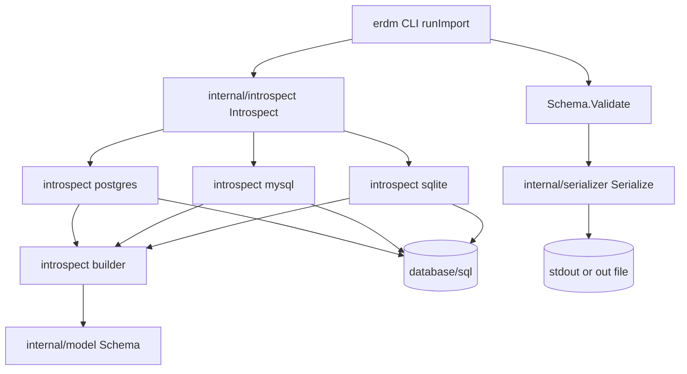

# 技術設計 — DSN 指定による erdm ファイル生成機能

## 概要

### 目的
PostgreSQL / SQLite / MySQL の稼働中データベースに DSN 指定で接続し、内部スキーマを `*model.Schema` として取得し、既存 `internal/serializer.Serialize` で `.erdm` テキストへ変換出力する CLI サブコマンド `erdm import` を新設する。

### 対象ユーザー
- 既存 DB 設計資産を ER 図化したい開発者
- 生成された `.erdm` を `erdm render` または `erdm serve` のループに接続したい運用者

### 影響範囲
| 影響 | 対象 |
|------|------|
| 追加 | `internal/introspect/` パッケージ新設、`erdm.go` に `runImport` 追加、`go.mod` に DB ドライバ 3 件追加 |
| 維持 | `internal/parser`, `internal/serializer`, `internal/model`, `internal/server`, `internal/dot/elk/html/ddl/layout` は無改修 |
| 互換性 | 既存 `render` / `serve` サブコマンドは無変更（要件 1.7） |

### 設計上の指針
- **再利用優先**: `.erdm` テキストを直接組み立てず、`*model.Schema` を構築 → `serializer.Serialize` で変換。これにより要件 9.1-9.3（往復冪等性）は serializer 側の保証に委譲できる。
- **DB ドライバ依存の隔離**: ドライバ blank import は `erdm.go` と `internal/introspect/` 配下に限定（要件 12.3）。
- **公開 API 最小化**: `internal/introspect` パッケージが外部公開する関数は `Introspect` 1 本のみ。

## アーキテクチャ

### パターン
レイヤード（CLI → ドメイン操作 → ドライバ別アダプタ）。本機能は単一機能であり、Vertical Slice Architecture を持ち込むほどの規模ではない。

### 境界マップ



### 技術スタック

| 層 | 技術 | バージョン目安 |
|----|------|---------------|
| 言語 | Go | 1.26.1（既存）|
| DB 抽象 | `database/sql`（標準ライブラリ）| - |
| PostgreSQL ドライバ | `github.com/jackc/pgx/v5/stdlib`（ブランクインポート）| v5 系最新 |
| MySQL ドライバ | `github.com/go-sql-driver/mysql` | 最新安定版 |
| SQLite ドライバ | `modernc.org/sqlite`（純 Go、CGO 不要）| 最新安定版 |
| シリアライザ | `internal/serializer`（既存）| - |
| パーサ | `internal/parser`（既存。テストでの往復確認のみ利用）| - |

### 依存方向

```
erdm.go (CLI)
   └→ internal/introspect (ドメイン操作)
        ├→ internal/model (ドメイン)
        └→ database/sql (インフラ)
   └→ internal/serializer (既存)
        └→ internal/model (ドメイン)
```

逆方向依存（model → introspect、serializer → introspect 等）はない。

## コンポーネントとインターフェース

### サマリー表

| コンポーネント | 配置 | 責務 | 関連要件 |
|---------------|------|------|---------|
| `runImport` | `erdm.go` | `import` サブコマンドの引数解析・パイプライン配線・終了コード制御 | 1.1-1.7, 11.1-11.4 |
| `introspect.Introspect` | `internal/introspect/introspect.go` | DB 接続・READ ONLY トランザクション・テーブル/カラム/PK/FK/インデックス/コメント取得の総合調整 | 3.x, 4.x, 5.x, 6.x, 7.x, 8.x, 10.1-10.3, 12.2 |
| `introspect.Options` | `internal/introspect/options.go` | 引数の値オブジェクト（Driver/DSN/Schema/Title）| 1.2-1.6, 2.1-2.4, 9.5-9.6 |
| `introspect.DetectDriver` | `internal/introspect/driver.go` | DSN プレフィックス・拡張子からドライバを推定し `Driver` enum を返す | 1.5, 2.4 |
| `introspect.MaskDSN` | `internal/introspect/mask.go` | エラーメッセージ用の DSN パスワードマスク | 2.5, 10.4 |
| `introspect.postgresIntrospector` | `internal/introspect/postgres.go` | PostgreSQL 用の SQL 発行と raw DTO 構築 | 2.1, 3.1, 3.3-3.4, 4.x, 5.x, 6.x, 7.x, 8.1, 10.2 |
| `introspect.mysqlIntrospector` | `internal/introspect/mysql.go` | MySQL 用の SQL 発行と raw DTO 構築 | 2.2, 3.1, 3.3, 4.x, 5.x, 6.x, 7.x, 8.2, 10.2 |
| `introspect.sqliteIntrospector` | `internal/introspect/sqlite.go` | SQLite 用の PRAGMA 発行と raw DTO 構築、CREATE TABLE 文からのコメント抽出 | 2.3, 3.1, 4.x, 5.x, 6.x, 7.x, 8.3 |
| `introspect.buildSchema` | `internal/introspect/builder.go` | raw DTO → `*model.Schema` 変換（論理名フォールバック・FK カーディナリティ決定・スコープ外参照スキップ）| 4.7, 6.1-6.5, 8.4-8.7, 9.4-9.6 |
| `introspect.types` | `internal/introspect/types.go` | 内部一時 DTO（`rawTable`/`rawColumn`/`rawForeignKey`/`rawIndex`）の型定義 | - |

### 詳細

#### `runImport(args []string) error`

- **入力**: `args = os.Args[1:][1:]`（先頭の `import` を除いた残り）
- **責務**:
  1. `flag.NewFlagSet("import", ContinueOnError)` でフラグを解析（`--driver`, `--dsn`, `--out`, `--title`, `--schema`）。
  2. `--dsn` 必須・空チェック（要件 1.6）。
  3. `introspect.DetectDriver(dsn, driverFlag)` でドライバ確定。失敗なら non-zero 終了（要件 2.4）。
  4. `introspect.Introspect(ctx, opts)` 呼び出し。
  5. `schema.Validate()` で要件 9.2 を担保。違反時はファイル書き出しせず error を返す（要件 11.3）。
  6. `serializer.Serialize(schema)` で `.erdm` バイト列を取得。
  7. `--out` 指定: ディレクトリ存在検査（要件 11.4）後、ファイル書き出し。未指定: 標準出力（要件 1.4）。
- **出力**: `error`（`main` で non-zero 終了に変換）
- **使用要件**: 1.1, 1.2, 1.3, 1.4, 1.5, 1.6, 1.7, 9.5, 9.6, 11.1, 11.2, 11.3, 11.4

#### `introspect.Introspect(ctx context.Context, opts Options) (*model.Schema, error)`

- **入力**: `Options{Driver, DSN, Schema, Title}`
- **責務**:
  1. ドライバ別 DSN 検証（postgres/mysql/sqlite）と接続オープン。
  2. `Conn.Ping` で疎通確認。失敗時は DSN マスク済みエラーを返す（要件 2.5）。
  3. PostgreSQL/MySQL は READ ONLY トランザクション開始（要件 10.2）。SQLite は単純な接続のまま、SELECT/PRAGMA のみ発行（要件 10.1）。
  4. ドライバ別 `Introspector` を選択し `(rawTables, error)` を取得。
  5. `buildSchema(rawTables, opts)` で `*model.Schema` を構築。
  6. `defer conn.Close()` で接続を必ず閉じる（要件 10.3）。
- **出力**: `*model.Schema, error`
- **使用要件**: 3.1-3.6, 4.1-4.7, 5.1-5.3, 6.1-6.5, 7.1-7.3, 8.1-8.7, 9.4-9.6, 10.1-10.4, 12.2

#### `introspect.Options`

```
Options:
    Driver  Driver   // Postgres / MySQL / SQLite
    DSN     string
    Schema  string   // PG/MySQL のみ意味あり。空のとき PG は public、MySQL は接続 DB 名を採用
    Title   string   // 空のとき接続先 DB 名（PG/MySQL）またはファイル名ベース部（SQLite）を採用
```

#### `introspect.DetectDriver(dsn, override string) (Driver, error)`

- **入力**: `dsn`（生 DSN 文字列）, `override`（`--driver` 値、空文字列可）
- **責務**:
  - `override != ""`: postgres/mysql/sqlite に対応するか検証し対応 enum を返す。それ以外は `unsupported driver: <override>` エラー。
  - `override == ""`: DSN プレフィックスで推定。
    - `postgres://` または `postgresql://` → `Postgres`
    - `mysql://` → `MySQL`
    - `file:` または拡張子 `.db`/`.sqlite`/`.sqlite3` → `SQLite`
    - 他: `cannot infer driver from DSN`
- **使用要件**: 1.5, 2.4

#### `introspect.MaskDSN(driver Driver, dsn string) string`

- **入力**: ドライバと生 DSN
- **責務**: パスワード位置を `***` に置換した新 DSN を返す。
  - Postgres: `net/url` で URL パース → `URL.User = url.UserPassword(user, "***")` → 再構築
  - MySQL: `mysql.ParseDSN(dsn)` → `cfg.Passwd = "***"` → `cfg.FormatDSN()`
  - SQLite: `dsn` をそのまま返す（パスワード概念なし）
- **使用要件**: 2.5, 10.4

#### `introspect.postgresIntrospector`

- **責務**: 接続済 `*sql.Tx`（READ ONLY）に対して以下の SELECT を発行し、`rawTable` 配列を返す。
  - テーブル一覧: `information_schema.tables` から `table_schema = $1 AND table_type = 'BASE TABLE'` を取得。`$1` は `Options.Schema`（空なら `public`、要件 3.4）。
  - 除外: `pg_catalog`, `information_schema` は WHERE で除外（要件 3.1）。ビューは `table_type='BASE TABLE'` で除外（要件 3.2）。
  - カラム: `information_schema.columns` ORDER BY `ordinal_position`（要件 4.1）。
  - 主キー: `information_schema.table_constraints` + `key_column_usage` JOIN（要件 5.1-5.3）。
  - 外部キー: `information_schema.referential_constraints` + `key_column_usage` JOIN（要件 6.1-6.4）。複合 FK は `position_in_unique_constraint` でグルーピング。
  - インデックス: `pg_index` + `pg_class` + `pg_attribute` 結合（要件 7.1-7.3）。
  - コメント: `pg_description` JOIN `pg_class`/`pg_attribute`（要件 8.1）。
- **正規化**: `column_default LIKE 'nextval(%'` + `data_type IN ('smallint','integer','bigint')` の場合に `serial`/`bigserial` 等へ正規化し、`Default` をクリア（要件 4.7）。
- **使用要件**: 2.1, 3.1, 3.3, 3.4, 4.1-4.7, 5.1-5.3, 6.1-6.4, 7.1-7.3, 8.1, 10.2

#### `introspect.mysqlIntrospector`

- **責務**: 接続済 `*sql.Tx`（READ ONLY）に対して以下を発行。
  - テーブル一覧: `information_schema.tables` から `table_schema = ? AND table_type = 'BASE TABLE'` を取得。`?` は `Options.Schema`（空なら接続 DB 名）。
  - 除外: `information_schema`, `mysql`, `performance_schema`, `sys` を WHERE で除外（要件 3.1）。
  - カラム: `information_schema.columns` ORDER BY `ORDINAL_POSITION`。
  - 主キー: `information_schema.table_constraints` + `key_column_usage` JOIN where `constraint_type = 'PRIMARY KEY'`。
  - 外部キー: `information_schema.referential_constraints` + `key_column_usage`。
  - インデックス: `information_schema.statistics` を `INDEX_NAME, SEQ_IN_INDEX` で集約。`PRIMARY` 名と PK/UQ 重複は除外。
  - コメント: `information_schema.tables.TABLE_COMMENT`, `information_schema.columns.COLUMN_COMMENT`（要件 8.2）。
- **正規化**: `extra LIKE '%auto_increment%'` のカラムは `Default` をクリア（要件 4.7）。
- **使用要件**: 2.2, 3.1, 3.3, 4.1-4.7, 5.1-5.3, 6.1-6.4, 7.1-7.3, 8.2, 10.2

#### `introspect.sqliteIntrospector`

- **責務**:
  - テーブル一覧: `SELECT name, sql FROM sqlite_master WHERE type='table' AND name NOT LIKE 'sqlite_%'`（要件 3.1, 3.2）。
  - カラム: `SELECT cid, name, type, "notnull", dflt_value, pk FROM pragma_table_info(?)`（要件 4.1）。
  - 外部キー: `SELECT id, seq, "table", "from", "to" FROM pragma_foreign_key_list(?)`。
  - インデックス: `pragma_index_list(?)` + `pragma_index_info(?)`。`origin='pk'` および `origin='u'` は要件 7.1 により除外。
  - 単一カラム UNIQUE 検出: `pragma_index_list` + `pragma_index_info` で 1 カラムのみのインデックスを `IsUnique` として `Column.IsUnique` に反映（要件 4.4）。
  - コメント: `sqlite_master.sql` の文字列をパッケージ内ヘルパで簡易パースし、行末コメントとカラム名の対応を抽出（要件 8.3、取得不能時は空）。
- **正規化**: `pk=1` かつカラム単独 PK かつ `type` が空または `INTEGER`（大小文字無視）の場合は SQLite の自動 ROWID 連番列とみなし `Default` クリア。型は元の `type` を保持（空文字列の場合は `integer` を採用）（要件 4.7）。
- **使用要件**: 2.3, 3.1, 3.2, 4.1-4.7, 5.1-5.3, 6.1-6.4, 7.1-7.3, 8.3

#### `introspect.buildSchema(raws []rawTable, opts Options, knownTables map[string]struct{}) (*model.Schema, error)`

- **入力**: `rawTable` 配列（ドライバ非依存形式）と取得対象テーブル名集合
- **責務**:
  1. 0 件の場合 `no user tables found in schema` エラーを返す（要件 3.5）。
  2. 各 `rawTable` を `model.Table` に変換。論理名は `LogicalName(physical, comment)` に従う（要件 8.4-8.7）。
  3. 各 `rawColumn` を `model.Column` に変換。`AllowNull = !NotNull`、`IsUnique` は単一カラム UNIQUE のみ true。
  4. 主キー添字配列 `PrimaryKeys []int` を構築（要件 5.1-5.3）。
  5. FK 構築:
     - 参照先テーブルが `knownTables` に含まれない場合、警告を `os.Stderr` に出し、当該 FK を生成しない（要件 6.5）。
     - 複合 FK は先頭カラムにのみ `FK` を付与（要件 6.4）。
     - カーディナリティ決定（research.md §3.4 に集約）。
  6. インデックスを `model.Index` に変換し、PK/UQ 起源を除外（要件 7.1）。
  7. `Schema.Title` を `opts.Title` または推定値に設定（要件 9.5-9.6）。
- **使用要件**: 3.5, 4.x, 5.x, 6.1-6.5, 7.1-7.3, 8.4-8.7, 9.4-9.6

#### `introspect.types`

```
rawTable:
    Name        string
    Comment     string
    Columns     []rawColumn
    PrimaryKey  []string         // 構成カラム物理名（宣言順）
    ForeignKeys []rawForeignKey
    Indexes     []rawIndex

rawColumn:
    Name        string
    Type        string           // 正規化済み
    Comment     string
    NotNull     bool
    IsUnique    bool             // 単一カラム UNIQUE 制約 or 単一カラム UNIQUE INDEX
    Default     string           // 自動増分は空にクリア済み

rawForeignKey:
    SourceColumns []string       // 構成カラム物理名（宣言順）
    TargetTable   string
    SourceUnique  bool           // 単一カラム FK で参照元が UNIQUE のとき true（要件 6.3）

rawIndex:
    Name     string
    Columns  []string
    IsUnique bool
```

## データモデル

### ドメインモデル
本機能は新規ドメインモデルを導入しない。既存 `internal/model.Schema/Table/Column/FK/Index` をそのまま構築・出力する。

### 内部 DTO（`introspect.types`）
ドライバ層と `buildSchema` の境界を担う一時 DTO。`*model.Schema` への変換が完了したら破棄される。永続化されない。

### 論理データモデル
本機能はテーブルを新設しない（読み取り専用）。

### 物理データモデル
ドライバ別の SELECT 文・PRAGMA 一覧（`research.md §2.4` を参照）。

## エラー処理戦略

| 発生事象 | 対応 | 終了コード | 関連要件 |
|---------|------|-----------|---------|
| `--dsn` 未指定 | 標準エラーへ usage 出力 | 非ゼロ | 1.6 |
| `--driver` がサポート外 | `unsupported driver: <値>`、DB 接続を試みない | 非ゼロ | 2.4 |
| DSN からドライバ推定不能 | `cannot infer driver from DSN` | 非ゼロ | 1.5（裏返し） |
| DB 接続失敗 | DSN パスワードマスク後にエラー出力 | 非ゼロ | 2.5, 10.4, 11.2 |
| 取得テーブル 0 件 | `no user tables found in schema` | 非ゼロ | 3.5 |
| `Schema.Validate()` 違反 | 違反内容を出力、ファイル未書き出し | 非ゼロ | 9.2, 11.3 |
| `--out` の親ディレクトリ不在 | `output directory not found: <パス>` | 非ゼロ | 11.4 |
| FK 参照先がスコープ外 | 警告を標準エラーへ、当該 FK 行を出力しない | 0（処理継続） | 6.5 |
| `.erdm` 書き出し失敗 | I/O エラーを標準エラーへ | 非ゼロ | 11.2 |

接続クローズは `defer` で必ず実行する（要件 10.3）。エラーログ出力時は `MaskDSN` を経由した文字列のみを利用する（要件 10.4）。

## 要件トレーサビリティ

| 要件 | サマリー | コンポーネント | インターフェース |
|------|---------|---------------|-----------------|
| 1.1 | `import` サブコマンド分岐 | `runImport` | `main()` の `args[0] == "import"` 分岐 |
| 1.2 | `--driver` / `--dsn` の値取得 | `runImport` | `flag.FlagSet.String` |
| 1.3 | `--out` ファイル書き出し | `runImport` | `os.WriteFile` |
| 1.4 | `--out` 省略時の標準出力 | `runImport` | `os.Stdout.Write` |
| 1.5 | `--driver` 省略時の DSN 推定 | `introspect.DetectDriver` | DSN プレフィックス・拡張子マッチ |
| 1.6 | `--dsn` 未指定時の usage 出力 | `runImport` | usage 文字列 + 非ゼロ |
| 1.7 | render/serve の動作不変 | `runImport`（追加のみ）| 既存 `runRender`/`runServe` 無改修 |
| 2.1 | postgres URL DSN 受理 | `postgresIntrospector` | `database/sql.Open("pgx", dsn)` |
| 2.2 | mysql `user:pass@tcp(...)` DSN 受理 | `mysqlIntrospector` | `database/sql.Open("mysql", dsn)` |
| 2.3 | sqlite ファイルパス / `file:` 受理 | `sqliteIntrospector` | `database/sql.Open("sqlite", dsn)` |
| 2.4 | サポート外 driver | `DetectDriver` | エラー返却、接続スキップ |
| 2.5 | 接続失敗時の DSN マスク | `MaskDSN` | URL 再構築 / mysql.Config.FormatDSN |
| 3.1 | システムスキーマ除外 | `*Introspector` | WHERE 句で除外 |
| 3.2 | ビュー・一時表除外 | `*Introspector` | `table_type='BASE TABLE'` / `sqlite_master` は `type='table'` |
| 3.3 | `--schema` 指定 | `Options.Schema` → `*Introspector` | バインド変数 |
| 3.4 | PG 既定 `public` | `Options` 構築時 | デフォルト値 |
| 3.5 | テーブル 0 件 | `buildSchema` | エラー返却 |
| 3.6 | 取得順序保持 | `*Introspector` | ドライバ既定の SQL 結果順を保持 |
| 4.1 | カラム宣言順保持 | `*Introspector` | ORDER BY ordinal_position / cid |
| 4.2 | 物理名・型出力 | `buildSchema` → `serializer.writeColumn` | `Column.Name`/`Column.Type` |
| 4.3 | NN 属性 | `buildSchema` | `Column.AllowNull = !rawNotNull` |
| 4.4 | 単一 UNIQUE 属性 | `*Introspector` | UNIQUE 制約 + 単一カラム UNIQUE INDEX 検出 |
| 4.5 | デフォルト値 | `*Introspector` → `buildSchema` | `Column.Default` |
| 4.6 | NULL 許容かつ無デフォルトは無属性 | `serializer.writeColumnFlags` | 既存実装で担保 |
| 4.7 | 自動増分の正規化 | `*Introspector` | 型正規化 + Default クリア |
| 5.1 | PK の `+` 接頭辞 | `buildSchema` → `serializer.writeColumn` | `Column.IsPrimaryKey` |
| 5.2 | 複合 PK | `buildSchema` | `Table.PrimaryKeys []int` 全要素設定 |
| 5.3 | PK 無しは付与なし | `buildSchema` | `IsPrimaryKey = false` 維持 |
| 6.1 | NULL 許容 FK は `0..*--1` | `buildSchema` | カーディナリティロジック |
| 6.2 | NN FK は `1..*--1` | `buildSchema` | 同上 |
| 6.3 | UNIQUE 1 対 1 FK は `0..1--1` | `buildSchema` | 同上 |
| 6.4 | 複合 FK の先頭のみ FK 付与 | `buildSchema` | 先頭 column index にのみ `FK` を設定 |
| 6.5 | スコープ外参照 FK スキップ | `buildSchema` | knownTables マップ検査 + 警告 |
| 7.1 | PK/UQ 起源除外 | `*Introspector` | クエリ条件 |
| 7.2 | `index name(col)` 出力 | `buildSchema` → `serializer.writeIndex` | `Table.Indexes` |
| 7.3 | `unique index` 表記 | `serializer.writeIndex` | `Index.IsUnique = true` |
| 8.1 | PG コメント取得 | `postgresIntrospector` | `pg_description` |
| 8.2 | MySQL コメント取得 | `mysqlIntrospector` | `TABLE_COMMENT` / `COLUMN_COMMENT` |
| 8.3 | SQLite コメント抽出 | `sqliteIntrospector` | `sqlite_master.sql` の `--` 行抽出 |
| 8.4 | テーブル `<phys>/<log>` | `buildSchema` | `Table.LogicalName` |
| 8.5 | カラム `<phys>/<log>` | `buildSchema` | `Column.LogicalName` |
| 8.6 | コメント空のとき物理名フォールバック | `buildSchema` | LogicalName ヘルパ |
| 8.7 | `/`・改行サニタイズ | `buildSchema` | サニタイズ関数 |
| 9.1 | `parser.Parse` 受理 | `serializer.Serialize` 出力 | 既存 serializer の責務 |
| 9.2 | `Schema.Validate()` パス | `runImport` | 明示呼び出し |
| 9.3 | 往復冪等性 | `serializer.Serialize` | 既存実装で担保 |
| 9.4 | 1 行目 `# Title:` | `serializer.writeTitle` | 既存実装 |
| 9.5 | `--title` 指定値採用 | `Options.Title` | `Schema.Title = opts.Title` |
| 9.6 | 未指定時 DB 名/ファイル名採用 | `Options` 解決ロジック | DB 名抽出 / `filepath.Base` |
| 10.1 | SELECT/PRAGMA 限定 | `*Introspector` | クエリ実装で担保 |
| 10.2 | READ ONLY トランザクション | `Introspect` | PG: `BEGIN READ ONLY` / MySQL: `START TRANSACTION READ ONLY` |
| 10.3 | 接続クローズ | `Introspect` | `defer conn.Close()` / `defer tx.Rollback()` |
| 10.4 | DSN ログマスク | `MaskDSN` | エラー文言生成箇所すべてで経由 |
| 11.1 | 成功 0 終了 | `runImport` → `main` | error == nil 経路 |
| 11.2 | 失敗時非ゼロ | `runImport` → `main` | error != nil → `os.Exit(1)` |
| 11.3 | Validate 違反時はファイル未書き出し | `runImport` | Validate を Serialize/書き出しの**前**に実行 |
| 11.4 | `--out` 親ディレクトリ不在 | `runImport` | `os.Stat` 検査 |
| 12.1 | DB 依存の隔離 | `internal/introspect/` 新設 | 他パッケージは無改修 |
| 12.2 | `*model.Schema` を返す | `Introspect` シグネチャ | `(*model.Schema, error)` |
| 12.3 | ドライバ import 限定 | `erdm.go` / `internal/introspect/*.go` | blank import の配置場所 |

## テスト戦略

### ユニット
- **`introspect.DetectDriver`**: 全プレフィックスパターン + 拡張子パターン + override 値の組合せをテーブル駆動で網羅。
- **`introspect.MaskDSN`**: 各ドライバごとにパスワード位置の置換を確認。パスワード未設定 DSN・パスワード `:` 含み等のエッジケースを含める。
- **`introspect.buildSchema`**: 純粋関数として `rawTable` 入力 → `*model.Schema` 出力をテーブル駆動でテスト。
  - 論理名フォールバック（要件 8.4-8.7）
  - PK 単一・複合（要件 5.1-5.2）
  - FK の NN/U/通常パターン → カーディナリティ（要件 6.1-6.3）
  - 複合 FK 先頭のみ付与（要件 6.4）
  - スコープ外参照 FK の警告 + スキップ（要件 6.5）
  - 自動増分正規化（要件 4.7）
- **`runImport` 引数解析**: `--dsn` 必須、`--driver` 値検証、`--out`・`--title` の取得、`--schema` 既定値（PG）。
- **CLI 分岐**: `os.Args[1] == "import"` の場合に `runRender` が呼ばれないことを `runRender` 呼出回数で確認。

### 統合（タスク後段で別途整備）
- **PostgreSQL**: docker または `testcontainers-go` で起動した PG に対し、テストフィクスチャ DDL を投入 → `Introspect` → 期待 `.erdm` 文字列との一致を確認。`pg_description` でコメントを設定したケースとそうでないケースをそれぞれ検証。
- **MySQL**: 同上。`COLUMN_COMMENT` 設定ケースの検証。
- **SQLite**: 一時ファイルに `database/sql` で DDL 投入 → `Introspect` → `.erdm` 整合性確認。CGO 不要のため CI 上で軽量に走る。
- **共通**: 各 DBMS で生成した `.erdm` を `parser.Parse` → `Schema.Validate` → `serializer.Serialize` の往復に通し、要件 9.1-9.3 を再現する。

### E2E
- `runImport` を関数として呼び出し、tempdir に SQLite ファイルを作成 → 同関数で `--out` を指定して `.erdm` を生成 → 既存 `runRender` でその `.erdm` を読み込み、5 種出力（dot/png/html/pg.sql/sqlite3.sql）が生成できることを確認（`dot` 不在環境では skip）。

### 回帰
- 既存 `runRender` / `runServe` のテストは無改修で全件 pass することを CI で確認（要件 1.7）。

### コメント論理名のフォールバック確認
- **テスト方針**: コメント未設定の物理テーブル（`users`, `articles` 等）に対し、生成された `.erdm` が必ず `users/users` のような `<phys>/<phys>` 形式を含み、論理名が空欄にならないことをアサート（要件 8.6）。これがユーザー指示「基本コメントは論理名になるように」の保証点。
