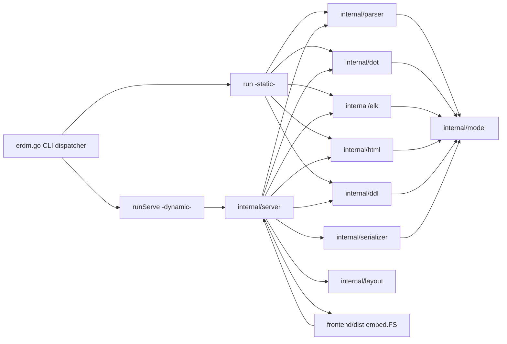
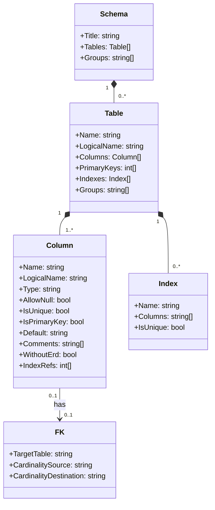
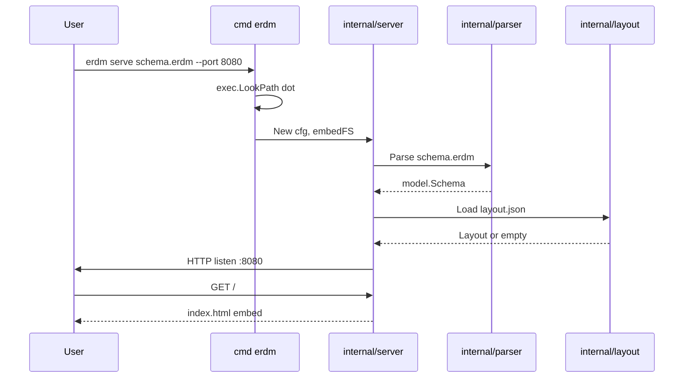
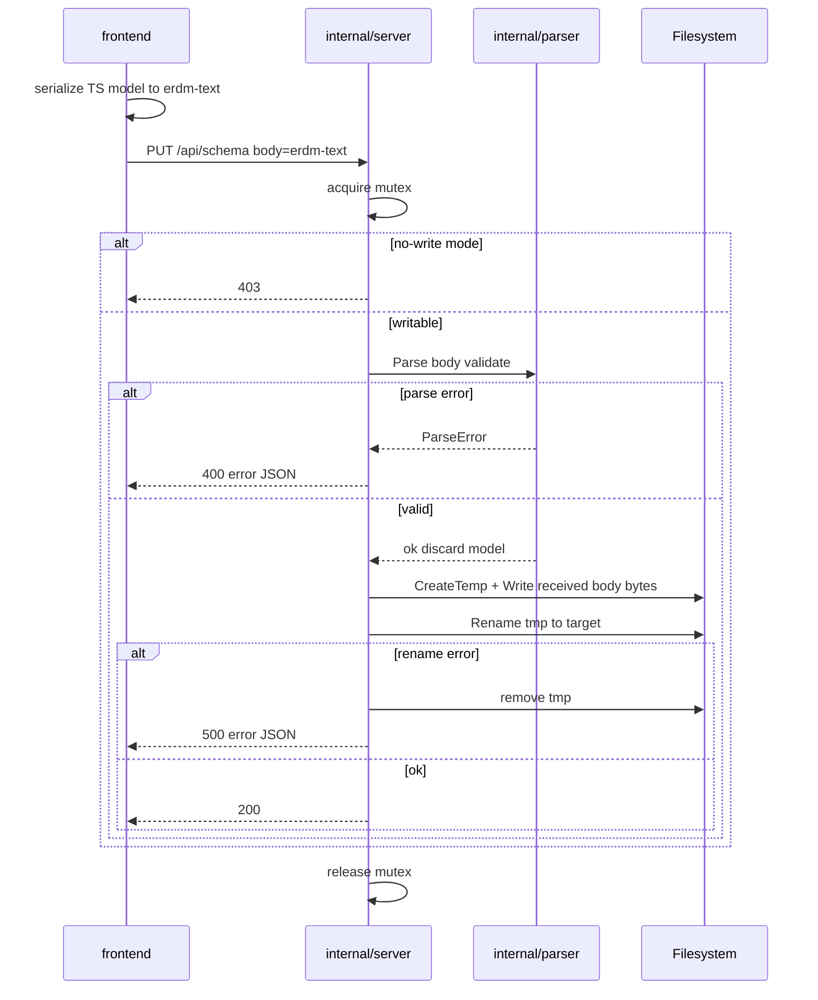

# 技術設計: ELK + Web UI 移行 (elk-webui-migration)

> 対応要件: `.kiro/specs/elk-webui-migration/requirements.md`
> 発見ログ: `.kiro/specs/elk-webui-migration/research.md`
> ギャップ分析: `.kiro/specs/elk-webui-migration/gap-analysis.md`

## 概要

### 目的

`erdm` を「Graphviz/DOT 単一バックエンドの CLI ツール」から「DOT 改善 + ELK + Web UI のローカルアプリケーション」へ段階的に移行し、ERD の可読性・編集性・配布性を同時に向上させる。

### 対象ユーザー

- **CLI 利用者**: 従来通り `.dot`/`.png`/`.html`/`.pg.sql`/`.sqlite3.sql` を生成したい既存ユーザー（後方互換維持）
- **ERD 設計者**: Web UI 上でテーブル/カラム/FK/`@groups` を編集し、`.erdm` を直接更新したいユーザー
- **ERD 閲覧者**: 大規模 ERD をブラウザでズーム/パン/サブセット表示したいユーザー
- **CI/Doc 利用者**: `--format=elk` で ELK JSON を取り出し、外部レイアウトエンジンや派生ツールに渡したいユーザー

### 影響範囲

- **コードベース**: 既存 `erdm.go` を CLI ディスパッチャに縮退、ドメイン処理を `internal/{model,parser,serializer,dot,elk,html,ddl,layout,server}` へ分割し、`frontend/` を新規作成。リポジトリルート `templates/` の旧テンプレートは `internal/{dot,html,ddl}` 配下へ新フィールド名で書き換えて移送し、ルートからは削除する。
- **ビルド**: `peg` 再生成 → `npm ci && npm run build` → `go build` の 3 段に統合。`build.sh` および `.circleci/` を更新。
- **配布**: フロント `dist/` を `embed.FS` で同梱した単一バイナリ。
- **互換性**: 旧 CLI 形態と出力ファイル名は完全維持。`.erdm` 文法は `@groups[...]` を上位互換で追加（既存ファイルはそのままパース可能）。

### 採用アプローチ（ギャップ分析より）

**C: ハイブリッド** — `erdm.go` を薄い CLI ディスパッチャに縮退、ドメイン処理を `internal/` へ移送、SPA は独立 `frontend/` で開発し `dist` を `go:embed` で同梱。

### 工数・リスク（ギャップ分析より）

- 全体: 工数 **XL**（2 週超）、リスク **High**
- フェーズ別工数/リスク: ギャップ分析の§工数・リスク表に従う

## アーキテクチャ

### パターン

- **ハイブリッド構造**: `cmd`（薄い CLI）+ `internal/{...}`（ドメイン）+ `frontend/`（SPA）
- **Hexagonal 風レイヤリング**: ドメイン（`model`）→ パーサ/シリアライザ（`parser`/`serializer`）→ レンダラ（`dot`/`elk`/`html`）→ 永続化（`layout`）→ 配信（`server`）
- **Vertical Slice の不採用**: 各層は要件 3.1 の指定どおり水平レイヤで分離する（`internal/model`/`internal/dot`/...）。1 機能あたりの跨ぎは最大 3 層で、Vertical Slice 化の閾値（3 ファイル以上）の境界線にあるが、横断的に再利用される `model`/`parser` の存在から横軸分割を選択する。

### 境界マップ



依存方向は左から右へ単方向。`internal/model` は他の internal パッケージから依存されるが、何にも依存しない（純粋構造体）。

### 技術スタック

| レイヤ | 採択 | 根拠 |
|---|---|---|
| バックエンド言語 | Go 1.26.1（既定） | 既存モジュール継続 |
| パーサ生成 | `pointlander/peg`（既定） | `erdm.peg.go` 既存資産。`tools.go` 方式でバージョン固定 |
| HTTP | `net/http` 標準ライブラリ | 外部依存最小、graceful shutdown も標準 API のみで実現 |
| 静的同梱 | `embed.FS`（既定） | `templates_files.go` で前例あり |
| フロントビルド | Vite + TypeScript | 軽量・高速、`go:embed` 親和性 |
| UI フレームワーク | React 18 | React Flow との親和性 |
| ERD 描画 | React Flow + elkjs | 要件 5.10 で明示 |
| テンプレ（DOT/DDL） | `text/template` | 既存テンプレ流用 |
| テンプレ（旧 HTML） | `html/template` | 既存テンプレ流用、XSS 対策維持 |
| ファイル原子的置換 | `os.CreateTemp` + `os.Rename` | 標準 API |
| ロック | `sync.Mutex`（プロセス内） | 要件 10.2（同一プロセス内の直列化のみ） |

## コンポーネントとインターフェース

### サマリー表

| パッケージ/モジュール | 単一責任（1 文） | 公開インターフェース | 主要な要件 |
|---|---|---|---|
| `cmd` (`erdm.go`) | コマンドライン引数を解析し、render モード（DOT/ELK 出力）と serve モードに振り分ける | `main()` のみ | 4.1, 5.1〜5.2, 9.1, 9.4, 10.1 |
| `internal/model` | スキーマのドメイン構造体を保持し、不変条件を提供する | `Schema`, `Table`, `Column`, `FK`, `Index`, `Group` | 2.1〜2.4, 3.2 |
| `internal/parser` | `.erdm` テキストからドメインモデルを生成する | `Parse([]byte) (*Schema, *ParseError)` | 2.1〜2.9, 3.3, 9.2, 9.5 |
| `internal/serializer` | ドメインモデルから `.erdm` テキストを生成する | `Serialize(*Schema) ([]byte, error)` | 7.6, 7.10 |
| `internal/dot` | ドメインモデルから DOT テキストを生成する | `Render(*Schema) (string, error)` | 1.1〜1.8, 2.10〜2.12, 3.4, 9.6 |
| `internal/elk` | ドメインモデルから ELK JSON を生成する | `Render(*Schema) ([]byte, error)` | 4.1〜4.7 |
| `internal/html` | 旧 HTML 出力（PNG 埋込み一覧）を生成する | `Render(*Schema, imgPath string) ([]byte, error)` | 9.1（旧互換） |
| `internal/ddl` | PG/SQLite3 DDL を生成する | `RenderPG(*Schema) ([]byte, error)`, `RenderSQLite(*Schema) ([]byte, error)` | 5.6, 8.1〜8.2, 9.1 |
| `internal/layout` | `<schema>.erdm.layout.json` の読み書きを担当する | `Load(path) (Layout, *LoadError)`, `Save(path, Layout) error` | 6.1〜6.6 |
| `internal/server` | HTTP API・SPA 配信・並行制御・graceful shutdown を担当する | `New(Config) *Server`, `(*Server).Run(ctx) error` | 5.1〜5.12, 6.1〜6.6, 7.1〜7.10, 8.1〜8.4, 9.3〜9.4, 10.2〜10.4 |
| `frontend/` | ERD 閲覧・編集・座標保存・エクスポート UI を提供する | SPA（HTTP 経由で `internal/server` と対話） | 5.10〜5.11, 6.1, 6.4〜6.5, 7.1〜7.6, 8.1〜8.4 |

### コンポーネント詳細

#### C1. `cmd`（`erdm.go`）

- **責任**: 引数解析とサブコマンド振り分けのみ。ドメインロジックを持たない。
- **公開境界**: `main()`
- **入力**: `os.Args`、環境変数 `PATH`
- **挙動**:
  - 第 1 引数が `serve` の場合 → `runServe(args[1:])`
  - それ以外 → `runRender(args)`（旧 CLI 互換: `[-output_dir DIR] [--format=dot|elk] <schema.erdm>`）
- **`runRender(args)` の詳細**:
  - `flag.NewFlagSet("render", ...)` で `-output_dir DIR`（既定: カレントディレクトリ）と `--format=dot|elk`（既定: `dot`）を解釈する
  - `--format=dot`（既定）: `exec.LookPath("dot")` を必須チェック（不在時は stderr + 非ゼロ終了、要件 9.1 維持） → 旧 CLI と同じ 5 種出力（`<basename>.dot`, `<basename>.png`, `<basename>.html`, `<basename>.pg.sql`, `<basename>.sqlite3.sql`）を `output_dir` に書き出す
  - `--format=elk`（要件 4.1）: `dot` 必須チェックを行わない（要件 9.4 と整合） → `internal/elk.Render(*Schema)` を呼び、`-output_dir` 指定時は `<output_dir>/<basename>.elk.json` に書き出し、未指定時（標準では指定されるが省略可とする）は標準出力へ書き出す
- **`runServe(args)` の詳細**:
  - `flag.NewFlagSet("serve", ...)` で `--port=N`（既定: 8080）、`--no-write`（既定: false）、`--listen=ADDR`（既定: `127.0.0.1`）を解釈する
  - 入力 `.erdm` ファイルが不存在/読取不可なら stderr に出力して非ゼロ終了（要件 10.1）
  - `dot` 必須チェックは行わず、`exec.LookPath("dot")` の結果を `hasDot bool` として `internal/server.Config` 経由で注入する（要件 9.4）
- **依存**: `internal/parser`、`internal/dot`、`internal/html`、`internal/ddl`、`internal/elk`、`internal/server`、標準 `flag`/`os/exec`
- **要件**: 4.1, 5.1〜5.2, 5.9, 9.1, 9.4, 10.1

#### C2. `internal/model`

- **責任**: ドメイン構造体（不変オブジェクト指向）を提供する。I/O・パース・レンダラを持たない。
- **公開境界**:
  - `Schema { Title string; Tables []Table; Groups []string }`
  - `Table { Name string; LogicalName string; Columns []Column; PrimaryKeys []int; Indexes []Index; Groups []string }`（`Groups[0]` が primary）
  - `Column { Name string; LogicalName string; Type string; AllowNull bool; IsUnique bool; IsPrimaryKey bool; Default string; Comments []string; WithoutErd bool; FK *FK; IndexRefs []int }`
  - `FK { TargetTable string; CardinalitySource string; CardinalityDestination string }`
  - `Index { Name string; Columns []string; IsUnique bool }`
  - `Group { Name string; Tables []string }`（プレゼンテーション派生用、derive 関数で生成）
- **不変条件**:
  - `Table.PrimaryKeys` の各要素は `len(Columns)` 未満
  - `Table.Groups` は要素数 0（ungrouped）または 1 以上、空文字列を含まない
  - `Column.FK != nil ⇒ Column.FK.TargetTable は Schema.Tables のいずれかの Name と一致`
- **依存**: なし（標準ライブラリのみ）
- **要件**: 2.1〜2.4, 3.2

#### C3. `internal/parser`

- **責任**: `.erdm` バイト列からドメインモデルを生成する。
- **公開境界**:
  - `Parse(src []byte) (*model.Schema, *ParseError)`
  - `ParseError { Pos int; Line int; Column int; Message string }`
- **挙動**:
  - 内部で `pointlander/peg` 生成の `Parser` を駆動。レシーバメソッド（`addTableTitleReal` 等）は internal 専用。
  - `@groups[]` の空配列、引用符未閉じ、トップレベル `group { ... }`、同一テーブルの `@groups` 重複は `ParseError` を返す（要件 2.5/2.6/2.8/2.9）。
  - `@groups` を持たないテーブルは `Groups: nil`（ungrouped）として扱う（要件 2.2/9.2）。
- **PEG 文法拡張**: `erdm.peg` の `table_name_info` ルールに以下を追加（HOW ではないが文法仕様として明示）:
  ```
  table_name_info <- <real_table_name> (... 既存 ...) (space+ groups_decl)? space* newline*
  groups_decl    <- '@groups' '[' string_lit (',' space* string_lit)* ']'
  string_lit     <- '"' (![\r\n"] .)* '"'
  ```
- **依存**: `internal/model`、`erdm.peg.go`（同パッケージ内に配置）
- **要件**: 2.1〜2.9, 3.3, 9.2, 9.5

#### C4. `internal/serializer`

- **責任**: ドメインモデルから `.erdm` テキストを正規化規則に従って生成する（往復冪等性のリファレンス実装）。
- **公開境界**:
  - `Serialize(s *model.Schema) ([]byte, error)`
- **正規化規則**: research.md §3.5 の表に従う（カラム順保持、`@groups` は引用符付き、コメント保持なし）。
- **冪等性**: `Serialize ∘ Parse ∘ Serialize ∘ Parse` が最初の `Parse` 結果と意味的に同一の `*model.Schema` を返す（要件 7.10）。
- **利用範囲**:
  - **要件 7.6 のシリアライズは SPA 側（`frontend/src/serializer/`）で TypeScript 実装**として行い、`PUT /api/schema` には SPA がシリアライズ済みテキストを送信する。
  - 本パッケージ（Go 側）は要件 7.10 の往復冪等性を Go 単体でも検証する**テスト基盤**として位置付け、加えて将来の CLI 側書き戻し（例: `erdm format` 等）への布石として API を公開する。
  - **`PUT /api/schema` ハンドラからは呼び出さない**（受信テキストはそのまま保存する。詳細は C10）。
- **依存**: `internal/model`
- **要件**: 7.10

#### C5. `internal/dot`

- **責任**: ドメインモデルから DOT テキストを生成する。
- **公開境界**:
  - `Render(s *model.Schema) (string, error)`
- **規約（要件 1.1〜1.8, 2.10〜2.12 を充足）**:
  - グラフ属性: `rankdir=LR`, `splines=ortho`, `nodesep=0.8`, `ranksep=1.2`, `concentrate=false`
  - エッジ方向: `親 -> 子`（子テーブルの FK カラムから親テーブルへの参照を反転して表現）
  - 同一親子間の複数 FK は独立エッジ
  - `WithoutErd` カラムから派生するエッジは出力しない
  - primary group ごとに `subgraph cluster_<group名>` を生成し、対応テーブルを cluster 内に配置
  - secondary group は DOT 出力に現れない
  - ungrouped テーブルは cluster に所属しない
- **テンプレート所有**: 本パッケージが `internal/dot/templates/*.tmpl` を own し、`embed.FS` で同梱する。新フィールド名（C2 の `Schema/Table/Column` 構造）を直接参照するよう書き換える。リポジトリルート `templates/` 配下の旧テンプレート（`dot.tmpl`/`dot_tables.tmpl`/`dot_relations.tmpl`）は、`erdm.go` 縮退と同一フェーズで削除する（テンプレート/モデル間の二重メンテを禁ずる）。
- **依存**: `internal/model`、`text/template`、`embed`
- **要件**: 1.1〜1.8, 2.10〜2.12, 3.4, 9.6

#### C6. `internal/elk`

- **責任**: ドメインモデルから elkjs 互換 JSON を生成する。
- **公開境界**:
  - `Render(s *model.Schema) ([]byte, error)`
- **規約（要件 4.1〜4.7 を充足）**:
  - 各テーブルは `{ id, width, height }` を持つ ELK ノード
  - 各 FK は `{ id, sources, targets }` で `親→子` 方向
  - primary group は `children` を持つ親ノード（groupNode）として表現
  - secondary group は `properties.secondaryGroups: string[]`
  - ungrouped テーブルはルート直下 `children`
  - 出力 JSON は `elkjs` の入力フォーマット仕様に整合
- **依存**: `internal/model`、`encoding/json`
- **要件**: 4.1〜4.7

#### C7. `internal/html`

- **責任**: 旧 HTML（PNG 埋込み + テーブル一覧）出力を維持する。
- **公開境界**:
  - `Render(s *model.Schema, imageFilename string) ([]byte, error)`
- **テンプレート所有**: 本パッケージが `internal/html/templates/html.tmpl` を own し、`embed.FS` で同梱する。新フィールド名（C2 の `Schema/Table/Column`）を直接参照するよう書き換える。
- **依存**: `internal/model`、`html/template`、`embed`
- **要件**: 9.1（旧互換）

#### C8. `internal/ddl`

- **責任**: PostgreSQL / SQLite3 DDL を生成する。
- **公開境界**:
  - `RenderPG(s *model.Schema) ([]byte, error)`
  - `RenderSQLite(s *model.Schema) ([]byte, error)`
- **テンプレート所有**: 本パッケージが `internal/ddl/templates/{pg,sqlite3}_ddl.tmpl` を own し、`embed.FS` で同梱する。新フィールド名（C2 の `Schema/Table/Column`）を直接参照するよう書き換える。
- **依存**: `internal/model`、`text/template`、`embed`
- **要件**: 5.6, 8.1〜8.2, 9.1

#### C9. `internal/layout`

- **責任**: `<schema>.erdm.layout.json` の読み書き、JSON 破損時のエラー型化。
- **公開境界**:
  - `Layout map[string]Position`（key = テーブル物理名）
  - `Position { X float64; Y float64 }`
  - `Load(path string) (Layout, *LoadError)`
  - `Save(path string, l Layout) error`
  - `LoadError { Path string; Cause string }`
- **挙動**:
  - ファイル不存在時 → 空 `Layout` を返す（`LoadError` ではない）
  - JSON 破損時 → `LoadError` を返し、サーバプロセスを停止しない（要件 6.6）
  - `Save` は `os.CreateTemp` + `os.Rename` で原子的置換（要件 10.3）
- **依存**: `encoding/json`, `os`
- **要件**: 6.1〜6.6, 10.3

#### C10. `internal/server`

- **責任**: HTTP API・SPA 配信・並行書込み制御・graceful shutdown を統合する。
- **公開境界**:
  - `Config { SchemaPath string; Port int; NoWrite bool; Listen string }`
  - `New(cfg Config, fs embed.FS) *Server`
  - `(*Server).Run(ctx context.Context) error`
- **HTTP エンドポイント**:

  | メソッド | パス | 用途 | 要件 |
  |---|---|---|---|
  | GET | `/` | SPA index.html | 5.3 |
  | GET | `/assets/*` | SPA assets | 5.3, 5.12 |
  | GET | `/api/schema` | 現スキーマ JSON | 5.4, 5.9 |
  | PUT | `/api/schema` | `.erdm` 書き戻し | 7.6〜7.9, 10.2〜10.3 |
  | GET | `/api/layout` | 座標 JSON | 5.5, 6.1, 6.6 |
  | PUT | `/api/layout` | 座標保存 | 6.1〜6.3, 10.2〜10.3 |
  | GET | `/api/export/ddl?dialect=pg\|sqlite3` | DDL | 5.6, 8.1〜8.2 |
  | GET | `/api/export/svg` | SVG（dot 経由） | 5.7, 8.3, 9.4 |
  | GET | `/api/export/png` | PNG（dot 経由） | 5.8, 8.4, 9.4 |

- **並行制御**: `sync.Mutex`（プロセス内 1 個）で `PUT /api/schema` と `PUT /api/layout` を直列化（要件 10.2）。
- **`PUT /api/schema` の保存セマンティクス**（要件 7.7 と整合）:
  - 受信したリクエストボディ（`.erdm` テキスト）を `internal/parser.Parse` に通し、**妥当性検証のみ**を行う（パース成功時は結果モデルを破棄する）。
  - パースエラー時は HTTP 400（元ファイル不変、要件 7.9）。
  - 妥当性検証 OK のとき、**受信テキストそのもの**を `os.CreateTemp(dir, base+".tmp.*")` に書き、`os.Rename(tmp, target)` で原子的置換する（要件 7.7・10.3）。
  - サーバ側で再シリアライズ（`internal/serializer.Serialize`）は行わない。`.erdm` の正規化責任は SPA 側（要件 7.6 で SPA がシリアライズすると規定）にあり、サーバはバイト単位で受信テキストを保存する。
- **原子的置換**: `internal/layout.Save` も同様に一時ファイル経由（要件 10.3）。失敗時は元ファイル不変。
- **`--no-write` モード**: `cfg.NoWrite == true` のとき `PUT /api/schema` および `PUT /api/layout` は HTTP 403（要件 6.3, 7.8）。
- **`dot` フォールバック**: `cmd` から注入された `cfg.HasDot bool` を参照し、`HasDot == false` のとき SVG/PNG ハンドラは HTTP 503（要件 9.4）。
- **graceful shutdown**: `signal.NotifyContext(ctx, SIGINT, SIGTERM)` → `http.Server.Shutdown(ctx)`（要件 10.4）。
- **依存**: `internal/parser`、`internal/dot`、`internal/elk`、`internal/ddl`、`internal/layout`、`net/http`、`os/exec`、`embed`（`internal/serializer` は本ハンドラから呼び出さない）
- **要件**: 5.1〜5.12, 6.1〜6.6, 7.7〜7.9, 8.3〜8.4, 9.3〜9.4, 10.2〜10.4

#### C11. `frontend/`（SPA）

- **責任**: ERD 閲覧・編集・座標保存・エクスポート UI を提供する。
- **公開境界**: HTTP のみ（`/api/*`）
- **構成**:

  | サブモジュール | 責任 |
  |---|---|
  | `src/api/` | `/api/*` への薄い fetch ラッパ |
  | `src/model/` | サーバ JSON ↔ 内部 TypeScript モデル変換 |
  | `src/serializer/` | 内部 TS モデル → `.erdm` テキストへのシリアライズ（要件 7.6 の主体） |
  | `src/layout/` | `elkjs` 連携、座標マージ（既存座標 > ELK 自動配置） |
  | `src/components/Canvas/` | React Flow キャンバス、ズーム・パン・ドラッグ |
  | `src/components/Editor/` | テーブル/カラム/FK/`@groups` 編集フォーム |
  | `src/components/ExportMenu/` | DDL/SVG/PNG ダウンロード UI |
  | `src/storage/` | `localStorage` 下書き保存 |

- **シリアライザ責任分担**:
  - SPA 側 `src/serializer/` が要件 7.6 の `.erdm` テキスト生成を担当する。
  - 正規化規則は research.md §3.5 の表に従い、Go 側の `internal/serializer` と同一規則を実装する。
  - 整合性は CI 上で「同じ `*Schema` JSON を入力したとき、Go の `internal/serializer.Serialize` と TS の `src/serializer.serialize` が**バイト単位で同一**のテキストを返す」ことをクロスチェックテストで検証する。
- **規約**:
  - 起動時: `GET /api/schema` + `GET /api/layout`、座標未登録テーブルのみ `elkjs` で自動配置（要件 6.4〜6.5）
  - `onNodeDragStop`: debounce 後に `PUT /api/layout`（要件 6.1）
  - 編集モード: 内部モデルを TypeScript で保持、保存時に `src/serializer/` で `.erdm` テキストへ変換し、Content-Type `text/plain` で `PUT /api/schema` へ送信（要件 7.6）
  - 下書き: 編集中は `localStorage` に逐次保存（要件 7.5）
- **要件**: 5.10〜5.11, 6.1, 6.4〜6.5, 7.1〜7.6, 8.1〜8.4

### テンプレートと新モデルのフィールド対応表

`internal/dot`/`internal/html`/`internal/ddl` の各 own テンプレートは、旧 `templates/*.tmpl` を**新フィールド名で書き換えて**配置する。アダプタ構造体は採用しない（モデル ↔ テンプレートの二重メンテナンスを避けるため）。

| 旧テンプレ参照 | 旧モデル位置（`erdm.go`） | 新モデル参照（C2） |
|---|---|---|
| `{{.Title}}` | `ErdM.Title` | `Schema.Title` |
| `{{.Tables}}` | `ErdM.Tables` | `Schema.Tables` |
| `{{.ImageFilename}}` | `ErdM.ImageFilename` | `internal/html.Render` の引数 `imageFilename` |
| `{{$t.TitleReal}}` / `{{.TitleReal}}` (Table) | `Table.TitleReal` | `Table.Name` |
| `{{$t.Title}}` / `{{.Title}}` (Table) | `Table.Title` | `Table.LogicalName` |
| `{{$t.Columns}}` / `{{.Columns}}` | `Table.Columns` | `Table.Columns` |
| `{{$t.PrimaryKeys}}` / `{{.PrimaryKeys}}` | `Table.PrimaryKeys []int` | `Table.PrimaryKeys []int` |
| `{{$t.Indexes}}` / `{{.Indexes}}` | `Table.Indexes` | `Table.Indexes` |
| `{{$t.GetPrimaryKeyColumns}}` | `Table.GetPrimaryKeyColumns()` | `Table.PrimaryKeyColumnNames()`（同等メソッド） |
| `{{.TitleReal}}` (Column) | `Column.TitleReal` | `Column.Name` |
| `{{.Title}}` (Column) | `Column.Title` | `Column.LogicalName` |
| `{{.Type}}` | `Column.Type` | `Column.Type` |
| `{{.AllowNull}}` | `Column.AllowNull` | `Column.AllowNull` |
| `{{.IsUnique}}` | `Column.IsUnique` | `Column.IsUnique` |
| `{{.IsPrimaryKey}}` | `Column.IsPrimaryKey` | `Column.IsPrimaryKey` |
| `{{.IsForeignKey}}` | `Column.IsForeignKey` | `Column.FK != nil` を返す `Column.IsForeignKey()` メソッド |
| `{{.Default}}` | `Column.Default` | `Column.Default` |
| `{{.HasDefaultSetting}}` | `Column.HasDefaultSetting()` | `Column.HasDefault()`（同等メソッド） |
| `{{.HasRelation}}` | `Column.HasRelation()` | `Column.FK != nil` を返す `Column.HasRelation()` メソッド |
| `{{.Relation.TableNameReal}}` | `Column.Relation.TableNameReal` | `Column.FK.TargetTable` |
| `{{.Relation.CardinalitySource}}` | 同上 | `Column.FK.CardinalitySource` |
| `{{.Relation.CardinalityDestination}}` | 同上 | `Column.FK.CardinalityDestination` |
| `{{.Comments}}` | `Column.Comments` | `Column.Comments` |
| `{{.HasComment}}` | `Column.HasComment()` | `Column.HasComment()`（同等メソッド） |
| `{{.IndexIndexes}}` | `Column.IndexIndexes` | `Column.IndexRefs` |
| `{{.WithoutErd}}` | `Column.WithoutErd` | `Column.WithoutErd` |
| `{{.GetIndexColumns}}` | `Index.GetIndexColumns()` | `Index.ColumnNames()`（同等メソッド） |

要件 3.6 の「意味的同等性」の許容差分は、要件 1.1〜1.7 由来の DOT 属性差分と親→子方向反転のみとする。それ以外は `internal/dot` のゴールデンテストで旧出力との一致を維持する。

## データモデル

### ドメインモデル（集約・エンティティ・値オブジェクト）



#### 集約境界

- **集約ルート**: `Schema`
- **エンティティ**: `Table`, `Column`, `Index`
- **値オブジェクト**: `FK`, `Group`, `Position`
- **不変条件**:
  - `Schema.Tables` 内のすべての `Table.Name` は一意
  - `Table.Groups[0]` が primary（`Groups != nil` のとき）
  - `Column.FK.TargetTable` は同 Schema 内に存在

### 論理データモデル（永続化）

| ストア | 種別 | 用途 |
|---|---|---|
| `<schema>.erdm` | テキストファイル | スキーマ本体（パース対象） |
| `<schema>.erdm.layout.json` | JSON ファイル | 手動配置座標。`{ "<table_name>": { "x": float, "y": float }, ... }` |
| `frontend/dist/` | バイナリ埋込み | SPA 静的アセット（`embed.FS`） |
| `internal/{dot,html,ddl}/templates/*.tmpl` | バイナリ埋込み | 各レンダラ専用テンプレート（パッケージ所有、新フィールド名で書き換え） |
| `localStorage`（ブラウザ） | KV | 編集中の下書き |

### 物理データモデル

- **ファイル原子性**: `.erdm` および `.erdm.layout.json` の書き込みは `os.CreateTemp(filepath.Dir(target), "<base>.tmp.*")` → `os.Rename(tmp, target)` で実施。同一ファイルシステム上での `rename(2)` は POSIX で原子的。
- **ロック**: プロセス内 `sync.Mutex` 1 個で書込みハンドラを直列化（要件 10.2）。プロセス間ロック（fcntl/flock）は本フィーチャーのスコープ外。

## 要件トレーサビリティ

| 要件 | サマリー | コンポーネント | インターフェース |
|---|---|---|---|
| 1.1〜1.5 | DOT 既定属性 | `internal/dot` | `Render(*Schema)` のグラフ属性既定 |
| 1.6 | エッジ方向 親→子 | `internal/dot` | `Render(*Schema)` の relations 出力 |
| 1.7 | 重複統合なし | `internal/dot` | 同上 |
| 1.8 | `-erd` カラム除外 | `internal/dot`, `internal/model` | `Column.WithoutErd` 参照 |
| 1.9 | スナップショット再生成 | `internal/dot` テスト | ゴールデンファイル比較 |
| 2.1〜2.4 | `@groups[...]` パース | `internal/parser`, `internal/model` | `Parse(...)`、`Table.Groups` |
| 2.5〜2.6 | 構文エラー（空配列・引用符） | `internal/parser` | `ParseError` |
| 2.7 | group 一覧の登場順保持 | `internal/parser`, `internal/model` | `Schema.Groups` |
| 2.8 | トップレベル `group { }` 禁止 | `internal/parser` | `ParseError` |
| 2.9 | 同一テーブル内 `@groups` 重複禁止 | `internal/parser` | `ParseError` |
| 2.10〜2.12 | DOT cluster 描画 | `internal/dot` | `Render(*Schema)` |
| 3.1 | `internal/{...}` 6 パッケージ存在 | リポジトリ構成全体 | — |
| 3.2 | `internal/model` 公開構造体 | `internal/model` | `Schema`/`Table`/`Column`/`FK`/`Index`/`Group` |
| 3.3 | `internal/parser` の公開関数 | `internal/parser` | `Parse(...)` |
| 3.4 | `internal/dot` の公開関数 | `internal/dot` | `Render(*Schema)` |
| 3.5 | 旧 CLI 出力ファイル維持 | `cmd`, `internal/dot`/`html`/`ddl` | `runRender(args)` |
| 3.6 | 旧 DOT 出力の意味的同等性 | `internal/dot` テスト | 差分テスト |
| 4.1 | `--format=elk` | `cmd`, `internal/elk` | `runRender(args)` の `flag.NewFlagSet` で `--format=dot\|elk` を解釈、`elk` 時は `dot` 必須チェックを省略し `<basename>.elk.json` または stdout に出力 |
| 4.2〜4.6 | ELK ノード/エッジ/階層化 | `internal/elk` | `Render(*Schema)` |
| 4.7 | elkjs 互換性 | `internal/elk` | 同上 |
| 5.1〜5.2 | HTTP サーバ起動・ポート指定 | `internal/server` | `New(Config)`, `Run(ctx)` |
| 5.3 | SPA index.html 配信 | `internal/server` | `GET /` |
| 5.4 | `GET /api/schema` | `internal/server`, `internal/parser` | 同左 |
| 5.5 | `GET /api/layout` | `internal/server`, `internal/layout` | 同左 |
| 5.6 | `GET /api/export/ddl` | `internal/server`, `internal/ddl` | 同左 |
| 5.7 | `GET /api/export/svg` | `internal/server`, `internal/dot` | 同左（`dot -Tsvg`） |
| 5.8 | `GET /api/export/png` | `internal/server`, `internal/dot` | 同左（`dot -Tpng`） |
| 5.9 | ファイル削除時 500 | `internal/server` | エラー JSON |
| 5.10 | SPA 描画 | `frontend/` | React Flow + elkjs |
| 5.11 | ズーム/パン | `frontend/` | React Flow デフォルト |
| 5.12 | embed.FS 同梱 | `internal/server` | `embed.FS` |
| 6.1 | ドラッグ完了 → PUT | `frontend/`, `internal/server` | `PUT /api/layout` |
| 6.2 | layout 書込み 200 | `internal/server`, `internal/layout` | `Save(...)` |
| 6.3 | `--no-write` で 403 | `internal/server` | `cfg.NoWrite` |
| 6.4 | 既存座標優先 | `frontend/` | `src/layout/` |
| 6.5 | 新規テーブルの自動配置 | `frontend/` | 同上 |
| 6.6 | layout 破損時 500 | `internal/server`, `internal/layout` | `LoadError` |
| 7.1〜7.4 | 編集 UI（テーブル/カラム/FK/groups） | `frontend/` | `src/components/Editor/` |
| 7.5 | localStorage 下書き | `frontend/` | `src/storage/` |
| 7.6 | 「保存」で `PUT /api/schema` | `frontend/` (`src/serializer/`) | TS 側シリアライザでテキスト生成 → `PUT /api/schema` |
| 7.7 | 受信テキストを上書き保存・200 | `internal/server` | 受信ボディを `Parse` で妥当性検証後、**受信ボディそのもの**を `os.CreateTemp` + `os.Rename` で保存 |
| 7.8 | `--no-write` で 403 | `internal/server` | `cfg.NoWrite` |
| 7.9 | パースエラー時 400・元ファイル不変 | `internal/server`, `internal/parser` | `ParseError` |
| 7.10 | 往復冪等性 | `internal/parser`, `internal/serializer`, `frontend/src/serializer/` | Go/TS 両側で往復テスト + クロスチェックテスト（同一 `*Schema` JSON で両者の出力がバイト一致） |
| 8.1〜8.2 | DDL DL UI + dialect | `frontend/`, `internal/server`, `internal/ddl` | `GET /api/export/ddl?dialect=...` |
| 8.3 | SVG DL UI | `frontend/`, `internal/server`, `internal/dot` | `GET /api/export/svg` |
| 8.4 | PNG DL UI | 同上 | `GET /api/export/png` |
| 8.5〜8.6 | README/Doc 更新 | リポジトリドキュメント | `README.md` 追記 |
| 9.1 | 旧 CLI 後方互換 | `cmd` | `runRender(args)` |
| 9.2 | `@groups` なしのパース | `internal/parser` | `Parse(...)` |
| 9.3 | 単一バイナリ配布 | ビルド構成、`internal/server` | `embed.FS` |
| 9.4 | dot 不在時の SVG/PNG 503 | `internal/server` | `hasDot` フラグ |
| 9.5 | parser ユニットテスト（`@groups` 有無） | `internal/parser` テスト | テストケース |
| 9.6 | dot スナップショット 3 種 | `internal/dot` テスト | ゴールデンファイル |
| 10.1 | 起動時のファイル不存在処理 | `cmd` (`runServe`) | 終了コード非ゼロ |
| 10.2 | 並行書込みの直列化 | `internal/server` | `sync.Mutex` |
| 10.3 | 原子的置換 | `internal/server`, `internal/layout`, `internal/serializer` | `os.CreateTemp` + `os.Rename` |
| 10.4 | graceful shutdown | `internal/server` | `http.Server.Shutdown` |

## エラー処理戦略

### 分類

| 分類 | 例 | 対応 |
|---|---|---|
| 入力エラー（ユーザー責任） | `.erdm` 構文エラー、`@groups[]` 空、JSON 不正 | HTTP 400 + エラー位置情報 JSON、CLI は stderr + 非ゼロ終了 |
| 不存在エラー | `.erdm` ファイル削除、layout JSON 不存在（後者は OK 扱い） | HTTP 500（schema）/ HTTP 200 `{}`（layout） |
| 破損エラー | layout JSON 破損 | HTTP 500（プロセスは継続、要件 6.6） |
| 権限エラー | `--no-write` モードでの PUT | HTTP 403 |
| 依存不在 | `dot` コマンド不在 | SVG/PNG ハンドラのみ HTTP 503、他は継続（要件 9.4） |
| I/O エラー | ディスク満杯、書込み失敗 | 一時ファイルを破棄、元ファイル不変、HTTP 500（要件 10.3） |
| 競合 | 並行 PUT | プロセス内ロックで直列化、待機（要件 10.2） |
| シグナル | SIGINT/SIGTERM | graceful shutdown（要件 10.4） |

### エラー型

- `internal/parser.ParseError`: `Pos`, `Line`, `Column`, `Message`
- `internal/layout.LoadError`: `Path`, `Cause`
- HTTP レスポンスは `{ "error": { "code": string, "message": string, "detail"?: object } }` の形式で統一

### 元ファイル保護（要件 7.9, 10.3）

- `PUT /api/schema` 受信時のシーケンス:
  1. リクエストボディを `Parse` して妥当性検証 → 失敗なら HTTP 400（元ファイル不変）
  2. `os.CreateTemp(dir, base+".tmp.*")` に書き込み
  3. `os.Rename(tmp, target)` で原子的置換 → 失敗なら一時ファイル削除、HTTP 500
  4. 成功時は HTTP 200

## テスト戦略

### ユニットテスト

| 対象 | テストケース | 要件 |
|---|---|---|
| `internal/parser` | `@groups[]` ありの正常系、`@groups[]` なしの正常系（後方互換）、構文エラー（空配列・引用符未閉じ・トップレベル group・重複 `@groups`） | 2.1〜2.9, 9.2, 9.5 |
| `internal/serializer` | `Serialize(Parse(input)) == input` の往復一致（正規化規則の範囲内）、`Parse(Serialize(model)) == model` の往復一致、TS 側 `frontend/src/serializer/` との出力バイト一致クロスチェック | 7.10 |
| `internal/dot` | primary group ありテーブル、secondary のみ、ungrouped、`-erd` カラム、複数 FK、cardinality 反転 | 1.1〜1.8, 2.10〜2.12, 9.6 |
| `internal/elk` | primary group 階層化、secondary properties、ungrouped ルート、エッジ方向、elkjs schema 整合 | 4.2〜4.7 |
| `internal/layout` | 不存在 → 空、破損 → `LoadError`、原子的書込み | 6.5, 6.6, 10.3 |
| `internal/server` | `--no-write` 403、`hasDot=false` で 503、並行 PUT 直列化、graceful shutdown | 6.3, 7.8, 9.4, 10.2, 10.4 |

### 統合テスト

| 対象 | シナリオ | 要件 |
|---|---|---|
| 旧 CLI 互換 | サンプル `.erdm` 4 種で `erdm -output_dir <tmp> sample.erdm` を実行し、5 種類の出力ファイルが生成されることを確認 | 3.5, 9.1 |
| DOT 同等性 | 旧テンプレ生成と新 `internal/dot` 生成の差分が要件 1 由来のみであることを diff テストで確認 | 3.6 |
| ELK CLI | `erdm --format=elk` の出力を `elkjs` で読み込んでレイアウト計算がエラーなく完了することを Node スクリプトで確認 | 4.7 |
| HTTP API | `httptest` で各エンドポイント（`/api/schema`、`/api/layout`、`/api/export/*`）の正常系・異常系・`--no-write` を網羅 | 5.4〜5.9, 6.1〜6.6, 7.6〜7.9, 8.1〜8.4 |
| 原子的置換 | 書込み中に `os.Remove` を割り込ませても元ファイルが破壊されないこと、I/O エラー時の挙動 | 10.3 |

### E2E テスト

| 対象 | シナリオ | 要件 |
|---|---|---|
| `frontend/` 単体 | Vite + Vitest で React Flow キャンバスのレンダリング・ドラッグ・PUT 呼び出しをモックでテスト | 5.10〜5.11, 6.1 |
| 統合 E2E（Playwright 任意） | `erdm serve` 起動 → ブラウザでスキーマロード → ノードドラッグ → リロードで座標復元 | 5.10, 6.1, 6.4 |
| 編集ラウンドトリップ | SPA で編集 → 保存 → 再ロードで内容一致（TS シリアライザ出力 == ファイル保存内容 == GET /api/schema 応答の元テキスト） | 7.1〜7.10 |
| TS/Go シリアライザ出力一致 | 共有 fixture（`*Schema` JSON）から TS と Go 両方でシリアライズし、バイト単位で一致を確認 | 7.6, 7.10 |

### テスト基盤

- Go: 標準 `testing` + `testdata/` ゴールデンファイル + `httptest`
- TypeScript: Vitest + React Testing Library（任意で Playwright）
- CI: 既存 `.circleci/` に `peg` 再生成、`npm run test`、`go test ./...` を追加

## ダイアグラム

### サーバ起動シーケンス



### 編集保存シーケンス

要件 7.7 の文言「受信した `.erdm` テキストを ... 元ファイルに上書き保存」に従い、**サーバ側で再シリアライズは行わず、受信テキストそのものを保存する**。SPA は要件 7.6 の規定どおり TS シリアライザで `.erdm` テキストを生成して送信する。



## 制約・前提

- Go 1.26.1、`pointlander/peg` 互換ジェネレータ、Node.js（フロントビルド用）が CI に存在すること。
- `dot` コマンドは旧 CLI モードで必須、`erdm serve` モードでは任意（不在時は SVG/PNG のみ 503）。
- プロセス間ロックはスコープ外。複数の `erdm serve` プロセスが同一 `.erdm` を編集することは想定しない。
- フロント開発時のホットリロード DX は本フィーチャーでは扱わない（research.md §3.4）。

## スコープ外

- `--focus <table> --depth N` 等のサブセット出力 CLI
- Graphviz バックエンドの将来的な廃止
- 排他制御（複数ユーザー編集、Git 衝突回避）のサーバ間ロック
- Vite dev server とのリバースプロキシ統合 DX
- `.erdm` のコメント保持（往復冪等性の対象外と明示）
