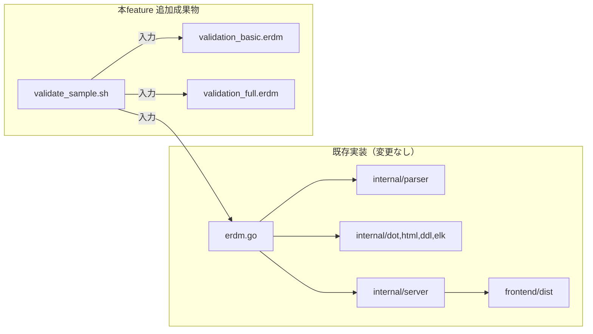
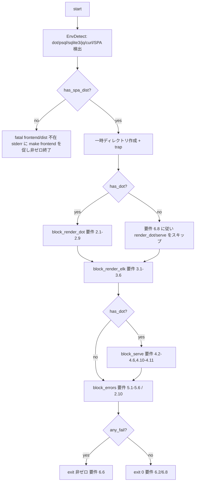

# design: sample-erdm-validation

## 概要

### 目的

`erdm` CLI（render / serve）が `.erdm` DSL を仕様通り処理することを、新規追加する検証用サンプル `.erdm` ファイルと検証スクリプトでエンドツーエンドに保証する。リグレッション検出の継続的な土台を提供する。

### 対象ユーザー

- **`erdm` 開発者**: 実装変更後に `bash scripts/validate_sample.sh` を実行し、render / serve の振る舞いが要件通りであることを確認する。
- **`erdm` 利用者**: `doc/sample/validation_*.erdm` を入力例として参照し、DSL の主要構文を学習する。

### 影響範囲

| 範囲 | 変更内容 |
|------|--------|
| 新規追加 | `doc/sample/validation_basic.erdm` / `doc/sample/validation_full.erdm` / `scripts/validate_sample.sh` |
| 変更しない | `erdm.go` / `internal/**` / `frontend/**` / 既存 `doc/sample/test*.erdm` / 既存テスト全般 |
| 要件文の修正 | 要件 4.3（解釈確定）/ 4.5（`postgres`→`pg`）/ 4.6（`sqlite`→`sqlite3`）— 実装値に整合させる方向で確定済み |

採用アプローチは **C: ハイブリッド**（gap-analysis.md の推奨）。実装変更ゼロで要件 7.1 / 7.2 / 7.3 を遵守する。

### 工数・リスク見積もり

| 観点 | 評価 | 根拠 |
|------|------|------|
| 工数 | **S（1-3日）** | 追加成果物 3 ファイル。DSL 構文網羅の設計と検証スクリプトのスキップ分岐検証で半日〜1日 |
| リスク | **Low** | 既知技術（bash + curl + sqlite3 + Graphviz）、既存スクリプト `check-requirements-coverage.sh` を参考に実装可能、外部依存はすべて検出 → スキップ分岐で吸収 |

## アーキテクチャ

### パターン

本feature は **「テストデータ + 検証ハーネス」**型の追加である。アプリケーションコードを増やさず、既存 CLI / API の利用者として観測点を提供する。

### 境界マップ

- **観測者（本feature）**: `scripts/validate_sample.sh`
- **観測対象（既存）**: `erdm` バイナリ（`runRender` / `runServe`）と HTTP API
- **観測手段**: ファイル出力検査（`test -f`、`dot -Tpng`、`sqlite3 :memory:`）/ HTTP リクエスト（`curl`）/ stderr / 終了コード

### 技術スタック

| 層 | 採用技術 | 理由 |
|----|--------|------|
| 検証スクリプト | `bash` 4.x + `set -euo pipefail` | 既存 `check-requirements-coverage.sh` と同様 |
| HTTP クライアント | `curl --silent --show-error --max-time 10 -w '%{http_code}'` | 環境依存最小、ステータスコード明示取得 |
| JSON 検証 | `jq -e .`（プライマリ）／ 不在時は grep ベースのフォールバック検証 | 要件 3.2 / 4.4（外部依存最小化） |
| ポート確保 | `bash` の `</dev/tcp/127.0.0.1/PORT` で接続不可 = 空きと判定 + リトライループ | 外部依存なし（research.md §2.3.1） |
| SQLite 検証 | `sqlite3 :memory:` | 要件 2.9 |
| PostgreSQL 検証 | `psql --set ON_ERROR_STOP=on -f` 利用可能時のみ | 要件 2.8（`等` の表現に従い、不在時はスキップ） |
| Graphviz 検証 | `dot -Tpng -o /dev/null` | 要件 2.7 |
| ELK 検証 | `jq -e .` または grep ベース粗検証 | 要件 3.2 |

## コンポーネントとインターフェース

### サマリー表

| コンポーネント | 責務 | 公開境界 | 配置 |
|------------|------|--------|------|
| `ValidationBasicSample` | 要件 1.3 を満たす最小 `.erdm` を提供 | ファイル本体（DSL テキスト） | `doc/sample/validation_basic.erdm` |
| `ValidationFullSample` | 要件 1.4〜1.13 を満たす構文網羅 `.erdm` を提供 | ファイル本体（DSL テキスト） | `doc/sample/validation_full.erdm` |
| `ValidationScript` | 要件 2.x / 3.x / 4.x（4.2-4.6, 4.10-4.11）/ 5.x をエンドツーエンドで検証 | `bash scripts/validate_sample.sh` のコマンド境界（引数なし、終了コードと stdout/stderr） | `scripts/validate_sample.sh` |
| `ValidationScript::EnvDetect` | `dot` / `psql` / `sqlite3` / `jq` / `curl` / SPA 同梱（`frontend/dist/index.html`）の有無を判定し、スキップ可否を決める | `has_dot` / `has_psql` / `has_sqlite3` / `has_jq` / `has_curl` / `has_spa_dist` の内部変数（プロセス内） | `validate_sample.sh` 内 |
| `ValidationScript::PortFinder` | テスト用空きポートを動的に取得（`18080` 起点） | 標準出力にポート番号を返す関数 `find_free_port()` | `validate_sample.sh` 内 |
| `ValidationScript::ServerFixture` | `erdm serve` をバックグラウンド起動し、レディ判定とクリーンアップを行う | `start_server()` / `stop_server()` 関数 | `validate_sample.sh` 内 |
| `ValidationScript::AssertHelper` | HTTP 応答・ファイル存在・stdout/stderr 文字列を検査して失敗時に明示メッセージを出す | `assert_eq` / `assert_contains` / `assert_status` 関数 | `validate_sample.sh` 内 |
| `ValidationScript::SkipController` | `dot` / `psql` / `sqlite3` / SPA 不在に応じて検証ブロックや個別 assert をスキップ判定する | `should_skip_block_dot()` / `should_skip_block_serve()` / `should_skip_psql()` / `should_skip_sqlite3()` 関数 | `validate_sample.sh` 内 |
| `ValidationScript::BlockRunner` | render(dot) / render(elk) / serve / errors の各検証ブロックを実行 | 各ブロック関数 `block_render_dot()` / `block_render_elk()` / `block_serve()` / `block_errors()` | `validate_sample.sh` 内 |

### 詳細

#### `ValidationBasicSample`（`doc/sample/validation_basic.erdm`）

- **責務**: 「`erdm` がパースできる最小サンプル」として要件 1.3 を満たす。
- **DSL 構成方針**:
  - `# Title:` 1 行（必須）
  - テーブル 2 個（PK 含む）
  - 1 つの単純な FK 関係
- **行数目安**: 15〜25 行
- **要件 1.5〜1.13 の網羅は不要**（それらは `validation_full.erdm` の責務）。

#### `ValidationFullSample`（`doc/sample/validation_full.erdm`）

- **責務**: DSL 主要構文を網羅し、要件 1.4〜1.13 をすべて満たす。
- **DSL 構成方針**:
  - 1.5: `# Title: ...` を 1 行目に配置
  - 1.6: `+id/論理名` 形式 PK を 3 テーブル以上に配置
  - 1.7: `[NN]` / `[U]` / `[=default]` / `[-erd]` を最低 1 回ずつ含む（同一テーブルに集約しない）
  - 1.8: `0..*--1` / `1--0..1`（または `0..*--0..1`）/ `1--1` の 3 種以上を含む
  - 1.9: 複合 index `index name (col1, col2)` を 1 個以上
  - 1.10: unique index `index name (...) unique` を 1 個以上
  - 1.11: `@groups["X", "Y"]`（複数グループ）を 1 個以上
  - 1.12: 列直後の `# コメント` を 1 個以上
  - 1.13: 論理名なし `name [type]` 形式の列を 1 個以上
- **行数目安**: 60〜100 行
- **テーブル数目安**: 4〜6（要件 1.6 の「3 個以上」を上回る冗長度）

#### `ValidationScript`（`scripts/validate_sample.sh`）

- **責務**: 要件 6.x（検証スクリプト）の本体。要件 2.x / 3.x / 4.x（4.2〜4.6, 4.10〜4.11）/ 5.x をエンドツーエンドで検証する。
- **インターフェース**:
  - 引数なしで実行
  - 終了コード: 全成功 = 0、いずれか失敗 = 非ゼロ（要件 6.6）
  - 標準出力: 検証ログ（成功時のサマリ）
  - 標準エラー: 失敗詳細（要件 6.6）

- **構造（dot 在時の通常フロー）**:

- **各ブロックの責務**:

| ブロック | 検証する要件 ID | 観測点 |
|---------|--------------|------|
| `block_render_dot` | 2.1 / 2.2 / 2.3 / 2.4 / 2.5 / 2.6 / 2.7 / 2.8（psql 利用可時のみ）/ 2.9 | `erdm -output_dir <DIR> validation_full.erdm` の終了コード = 0、5 種出力ファイル存在、`dot -Tpng` 終了コード、`sqlite3 :memory:` 終了コード、`psql --set ON_ERROR_STOP=on -f` 終了コード |
| `block_render_elk` | 3.1 / 3.2 / 3.3 / 3.4 / 3.5 | `erdm --format=elk validation_full.erdm` の stdout / `--format=elk -output_dir` でファイル生成 / PATH 制限下での dot 非依存動作 |
| `block_serve` | 4.2 / 4.3 / 4.4 / 4.5 / 4.6 / 4.10 / 4.11 | `erdm serve --port=
 validation_full.erdm` の HTTP 応答コード / Content-Type / 本文 |
| `block_errors` | 2.10 / 3.6 / 5.1 / 5.2 / 5.3 / 5.4 / 5.5 / 5.6 | `dot` 不在環境（PATH 制限）でのエラー、不在ファイル、ディレクトリ、構文エラー、unknown format、引数なし、ELK 構文エラー時の `parse <path>:` |

#### スキップ判定ポリシー（要件 6.8 に厳密準拠）

要件 6.8 は「`dot` 不在時は **要件 3.x（ELK）と要件 5.x（異常系）のみ**を検証して終了コード 0」と排他的に規定するため、本設計では **`has_dot=false` のとき `block_render_dot` と `block_serve` を両方スキップする** 方針を採用する（前回レビュー §問題 1 への対応）。

| 検出変数 | 値 | スキップ対象 | 残る検証 |
|---------|----|----------|--------|
| `has_dot` | `false` | `block_render_dot`（全 2.x）+ `block_serve`（全 4.x） | `block_render_elk`（3.x） + `block_errors`（5.x / 3.6 / 2.10 のうち PATH 制限再現可能項目） |
| `has_psql` | `false` | 要件 2.8 のみ（`block_render_dot` 内の個別 assert スキップ） | 同ブロック内の他 assert |
| `has_sqlite3` | `false` | 要件 2.9 のみ（同上） | 同上 |
| `has_jq` | `false` | なし（grep ベースフォールバックに自動切替） | 全項目 |
| `has_curl` | `false` | fatal（serve / errors ブロック検証不能） | — |
| `has_spa_dist` | `false` | fatal（`erdm serve` が `validateSPAIndex` で起動失敗するため） | — |

要件 2.10（dot 不在時のエラー）は `has_dot=true` でも PATH 制限下で `erdm` を再実行することで検証可能であり、`block_errors` 内で常時実行する。

#### `ValidationScript::EnvDetect`

- **責務**: 6 種の前提条件（`dot` / `psql` / `sqlite3` / `jq` / `curl` / SPA 同梱）の検出。
- **インターフェース**: 関数内でグローバル変数 `has_dot`, `has_psql`, `has_sqlite3`, `has_jq`, `has_curl`, `has_spa_dist` をセット。
- **検出方法**:
  - ツール 5 種: `command -v <tool> >/dev/null 2>&1` の終了コード判定
  - SPA 同梱: `erdm` バイナリ自体は同梱 SPA を持つため、ここでは外部の `frontend/dist/index.html` 存在ではなく **`erdm serve` 起動時の挙動** を判定基準とする。スクリプト本体では `frontend/dist/index.html` の存在を確認するに留める（リポジトリのフロント未ビルド時の早期検出）
- **不在時の動作**: §「スキップ判定ポリシー」の表に従う

#### `ValidationScript::PortFinder`

- **責務**: serve 起動用空きポートを取得。
- **インターフェース**: `find_free_port()` 関数が `18080` から 50 ポートまで順に走査し、空きを stdout に返す。失敗時は exit 非ゼロ。
- **判定方式**: `(echo > /dev/tcp/127.0.0.1/$port) >/dev/null 2>&1` が失敗 → ポート空き。

#### `ValidationScript::ServerFixture`

- **責務**: `erdm serve` のバックグラウンド起動と停止。
- **インターフェース**:
  - `start_server <port> <schema_path> [extra_flags...]` → `SERVER_PID` をセット、レディ確認まで wait
  - `stop_server` → `kill $SERVER_PID` し、終了を待つ
- **レディ判定**: `curl --silent --max-time 1 -o /dev/null http://127.0.0.1:<port>/` が 200 を返すまで最大 5 秒ポーリング。
- **クリーンアップ**: `trap` で `stop_server` を呼ぶ（要件 6.7）。

#### `ValidationScript::AssertHelper`

- **責務**: 観測値と期待値の比較。失敗時に何を期待し何が得られたかを stderr に明示。
- **関数**:
  - `assert_eq <actual> <expected> <label>`: 完全一致
  - `assert_contains <haystack> <needle> <label>`: 部分文字列含有
  - `assert_file_exists <path> <label>`: ファイル存在
  - `assert_exit_code <actual> <expected> <label>`: 終了コード比較
  - `assert_status <curl_status> <expected_code> <label>`: HTTP ステータス比較
- **失敗時の動作**: グローバル `FAIL_COUNT` をインクリメントし、最後にまとめて exit 非ゼロ（要件 6.6）。途中で `set -e` 系の即停止はしない（複数失敗を一括報告するため `set +e` を局所的に切替える）。

#### `ValidationScript::SkipController`

- **責務**: §「スキップ判定ポリシー」の判定ロジックを関数化し、各ブロック・assert の入口で参照可能にする。
- **関数**:
  - `should_skip_block_dot()` → `[ "$has_dot" = "false" ]`
  - `should_skip_block_serve()` → `[ "$has_dot" = "false" ]`
  - `should_skip_psql()` → `[ "$has_psql" = "false" ]`
  - `should_skip_sqlite3()` → `[ "$has_sqlite3" = "false" ]`
- **スキップ時の出力**: `[SKIP] block_<name>: <理由>` を stdout に明示（要件 6.8 の透明性）。

## データモデル

### ドメインモデル

本feature は新しいドメインモデルを導入しない。既存 `internal/model.Schema` を観測対象として扱う。

| エンティティ | 由来 | 本feature での扱い |
|----------|------|------------------|
| `Schema` | `internal/model/schema.go` | パース成功確認、JSON 形式での `Title`/`Tables[].Name` の存在確認 |
| `Table` / `Column` / `FK` / `Index` / `Group` | `internal/model/{table,column,fk,index,group}.go` | DSL 構文網羅サンプル設計時の参照 |

### 論理データモデル

本feature が扱うファイル成果物:

| ファイル | 役割 | 不変条件 |
|---------|------|--------|
| `doc/sample/validation_basic.erdm` | 最小 DSL（要件 1.3 専用） | UTF-8、改行 LF、`# Title:` 1 行を含む |
| `doc/sample/validation_full.erdm` | 構文網羅 DSL（要件 1.4-1.13） | UTF-8、改行 LF、要件 1.5-1.13 の構文を全て含む、`parser.Parse` が成功する |
| `scripts/validate_sample.sh` | 検証スクリプト | UTF-8、改行 LF、`#!/usr/bin/env bash` の shebang、`chmod +x` |
| `<TMPDIR>/validation_full.{dot,png,html,pg.sql,sqlite3.sql,elk.json}` | 一時生成物 | スクリプト終了時に `rm -rf $TMPDIR` で削除（要件 6.7） |

### 物理データモデル

| パス | 種別 | 永続性 |
|------|------|------|
| `doc/sample/validation_basic.erdm` | リポジトリ管理ファイル | 永続 |
| `doc/sample/validation_full.erdm` | リポジトリ管理ファイル | 永続 |
| `scripts/validate_sample.sh` | リポジトリ管理ファイル（実行権限付与） | 永続 |
| `$(mktemp -d)` 配下 | スクリプト一時領域 | 一時（trap で削除） |

## 要件トレーサビリティ

### 本feature が直接検証する要件

| 要件 | サマリー | コンポーネント | インターフェース |
|------|---------|-------------|---------------|
| 1.1 | `validation_basic.erdm` 配置 | `ValidationBasicSample` | ファイル本体 |
| 1.2 | `validation_full.erdm` 配置 | `ValidationFullSample` | ファイル本体 |
| 1.3 | basic がパース成功 | `ValidationBasicSample` | 既存 `parser.Parse` |
| 1.4 | full がパース成功 | `ValidationFullSample` | 既存 `parser.Parse` |
| 1.5 | full に `# Title:` を 1 行目 | `ValidationFullSample` | DSL 内容 |
| 1.6 | full に `+name` PK 列 ≧ 3 テーブル | `ValidationFullSample` | DSL 内容 |
| 1.7 | full に `[NN]/[U]/[=default]/[-erd]` 全種 | `ValidationFullSample` | DSL 内容 |
| 1.8 | full に 3 種以上のカーディナリティ | `ValidationFullSample` | DSL 内容 |
| 1.9 | full に複合 index ≧ 1 | `ValidationFullSample` | DSL 内容 |
| 1.10 | full に unique index ≧ 1 | `ValidationFullSample` | DSL 内容 |
| 1.11 | full に複数 `@groups` ≧ 1 | `ValidationFullSample` | DSL 内容 |
| 1.12 | full に列コメント ≧ 1 | `ValidationFullSample` | DSL 内容 |
| 1.13 | full に論理名なし列 ≧ 1 | `ValidationFullSample` | DSL 内容 |
| 2.1 | dot 在時 render 終了 0 | `ValidationScript::block_render_dot` | `erdm -output_dir <DIR> validation_full.erdm` |
| 2.2-2.6 | 5 種出力ファイル生成 | `block_render_dot` | `assert_file_exists` |
| 2.7 | dot 再描画成功 | `block_render_dot` | `dot -Tpng -o /dev/null` |
| 2.8 | pg.sql 構文 OK（psql 在時） | `block_render_dot` + `SkipController` | `psql --set ON_ERROR_STOP=on -f` |
| 2.9 | sqlite3.sql 構文 OK（sqlite3 在時） | `block_render_dot` + `SkipController` | `sqlite3 :memory: ".read"` |
| 2.10 | dot 不在時のエラー | `block_errors` | `PATH=` 制限下で `erdm` 実行 + stderr 検査 |
| 3.1 | ELK stdout 終了 0 | `block_render_elk` | `erdm --format=elk validation_full.erdm` |
| 3.2 | ELK JSON パース成功 | `block_render_elk` | `jq -e .` / フォールバック |
| 3.3 | ELK ファイル生成 | `block_render_elk` | `assert_file_exists` |
| 3.4 | ELK ファイル時 stdout 空 | `block_render_elk` | `assert_eq stdout_size 0` |
| 3.5 | ELK 時 dot 検査なし | `block_render_elk` | PATH 制限下で `--format=elk` 成功 |
| 3.6 | 不正 DSL ELK で `parse <path>:` | `block_errors` | stderr 検査 |
| 4.1 | HTTP リッスン開始 | `ServerFixture::start_server` | レディ判定ループ |
| 4.2 | GET / → 200 / text/html | `block_serve` | `curl -i` ヘッダ + ステータス検査 |
| 4.3 | GET /api/schema → 200 / json + テーブル名 | `block_serve` | `assert_status` + `assert_contains` |
| 4.4 | GET /api/layout → 200 / json | `block_serve` | `assert_status` + Content-Type 検査 |
| 4.5 | GET /api/export/ddl?dialect=pg → CREATE TABLE | `block_serve` | `assert_contains "$body" "CREATE TABLE"` |
| 4.6 | GET /api/export/ddl?dialect=sqlite3 → CREATE TABLE | `block_serve` | 同上 |
| 4.10 | --no-write 時 PUT /api/schema → 403 | `block_serve` | `start_server --no-write` 後の `curl -X PUT` |
| 4.11 | --no-write 時 PUT /api/layout → 403 | `block_serve` | 同上 |
| 5.1 | 不在ファイル → `input file:` | `block_errors` | stderr 検査 |
| 5.2 | ディレクトリ → `is a directory` | `block_errors` | stderr 検査 |
| 5.3 | 構文エラー → `parse` | `block_errors` | stderr 検査 |
| 5.4 | unknown format → `unknown format:` | `block_errors` | stderr 検査 |
| 5.5 | 引数なし → `Usage: erdm` | `block_errors` | stderr 検査 |
| 5.6 | serve 引数なし → `Usage: erdm serve` | `block_errors` | stderr 検査 |
| 6.1 | `scripts/validate_sample.sh` 配置 | `ValidationScript` | ファイル本体 |
| 6.2 | dot 在時 終了コード 0 | `ValidationScript` | スクリプト全体制御フロー |
| 6.3 | 要件 2.x の直列検証 | `block_render_dot` | スクリプト構造 |
| 6.4 | 要件 3.x の直列検証 | `block_render_elk` | スクリプト構造 |
| 6.5 | serve 起動 → 4.2-4.6,4.10-4.11 検証 → 停止 | `block_serve` + `ServerFixture` | start_server / stop_server |
| 6.6 | 失敗時 stderr + 非ゼロ終了 | `AssertHelper` | `FAIL_COUNT` + 最終 exit |
| 6.7 | 一時ディレクトリ作成・クリーンアップ | `ValidationScript`（trap） | `mktemp -d` + `trap rm -rf` |
| 6.8 | dot 不在時 2.x/4.x スキップ + 3.x/5.x のみ実行 → 終了 0 | `EnvDetect` + `SkipController` | `should_skip_block_dot/serve` 分岐 |
| 7.1 | 既存サンプル不変 | 全コンポーネント（運用制約） | 新規ファイルのみ追加 |
| 7.2 | 公開 API 不変 | 全コンポーネント | `internal/**` 変更なし |
| 7.3 | `make test` グリーン維持 | `ValidationScript`（運用） | スクリプトを `make test` に組み込まない |

### 本feature の対象外（既存テストでカバー）

要件 6.5 は serve ブロックの検証範囲を 4.2-4.6 / 4.10-4.11 に明示限定しており、以下の要件は本feature の検証スクリプトの対象外である。これらは既存 Go テストが同等観点を担保しているため、本feature が新規にカバーする必要はない（前回レビュー §問題 2 への対応）。

| 要件 | サマリー | 担保する既存テスト | 本feature での扱い |
|------|---------|----------------|-----------------|
| 4.7 | dot 在時 GET /api/export/svg → 200 / image/svg+xml | `internal/server/export_test.go`（image content-type 検証） | 対象外（要件 6.5 のスコープ外） |
| 4.8 | dot 在時 GET /api/export/png → 200 / image/png | `internal/server/export_test.go` | 対象外（要件 6.5 のスコープ外） |
| 4.9 | dot 不在時 GET /api/export/svg → 503 | `internal/server/export_test.go` / `error_response_test.go` | 対象外（要件 6.5 のスコープ外） |
| 4.12 | --no-write なし時 PUT /api/schema 正常系 → 200 + 更新 | `internal/server/schema_test.go`（原子的 rename テスト） | 対象外（要件 6.5 のスコープ外） |
| 4.13 | --no-write なし時 PUT /api/schema 不正 DSL → 400 + 未変更 | `internal/server/schema_test.go` / `error_response_test.go` | 対象外（要件 6.5 のスコープ外） |

## エラー処理戦略

### スクリプト内エラー

| 状況 | スクリプトの動作 | 終了コード |
|------|--------------|----------|
| `set -euo pipefail` で捕捉される予期せぬエラー | `trap` で `rm -rf $WORK` + サーバ kill 後に再 raise | 非ゼロ |
| `assert_*` 失敗 | stderr に `[FAIL] <label>: expected ... actual ...` 出力 / `FAIL_COUNT++` / 後続検証は継続 | 最終 exit で非ゼロ（要件 6.6） |
| `start_server` レディ判定タイムアウト（5 秒） | fatal、stderr に診断ログ | 非ゼロ |
| `validation_basic.erdm` / `validation_full.erdm` 不在 | fatal | 非ゼロ |
| `curl` 不在（`has_curl=false`） | fatal（serve / errors ブロック検証不能） | 非ゼロ |
| **SPA 同梱不在（`has_spa_dist=false`、`frontend/dist/index.html` 不在）** | **fatal、stderr に `frontend/dist/index.html not found; run 'make frontend' first` を出力** | **非ゼロ**（前回レビュー §問題 3 への対応） |
| ポート確保失敗（50 候補すべて埋まり） | fatal | 非ゼロ |
| `dot` 不在（要件 6.8） | `block_render_dot` + `block_serve` 全体スキップ、`block_render_elk` + `block_errors` のみ実行 | 0（要件 6.8） |
| `psql` 不在 | 要件 2.8 のみ `[SKIP] requirement 2.8: psql not found in PATH` ログ、当該 assert スキップ | 0（成功扱い） |
| `sqlite3` 不在 | 要件 2.9 のみ `[SKIP] requirement 2.9: sqlite3 not found in PATH` ログ、当該 assert スキップ | 0（成功扱い） |
| `jq` 不在 | grep ベースのフォールバック検証に自動切替（ログ出力のみ） | 0（成功扱い） |

### 観測対象（既存実装）のエラー応答

スクリプトは観測対象のエラー応答（要件 4.10 / 4.11 の 403、要件 5.x の非ゼロ終了）を **期待される失敗** として扱う:
- `curl --fail-with-body` は **使わない**（4xx を curl 自身の失敗にしない）
- `curl -w '%{http_code}' -o <body_tmp>` でステータスを取得し `assert_status` で検査
- `erdm` 異常系は `set +e` で局所的にエラー伝播を止め、終了コードと stderr を捕捉して `assert_*` で検査

### エラー戦略の原則

- **観測者は失敗を蓄積、最後に集約報告**: 1 件の失敗で即停止せず、可能な限り全要件を検査して `FAIL_COUNT` でまとめて報告
- **環境差異はスキップで吸収**: 外部ツール不在は要件違反ではなく環境差異として扱い、明示ログ + 成功扱い（要件 2.8 / 2.9 / 6.8）
- **クリーンアップ保証**: `trap ... EXIT INT TERM` で一時ディレクトリ削除とサーバプロセス停止を必ず実行（要件 6.7）
- **前提条件の早期検出**: SPA 同梱と入力サンプルの不在はスクリプト冒頭で fatal にし、原因不明の失敗を防ぐ

## テスト戦略

### ユニットテスト

本feature は新規 Go コード / TypeScript コードを含まないため、ユニットテストは追加しない。既存ユニットテスト（`internal/parser/parser_test.go` 等）が DSL 受理範囲を保証しており、`validation_*.erdm` がパース可能であることはスクリプトの起動時 sanity check（最初の `erdm --format=elk` 実行）で間接的に確認される。

### 統合テスト

**実態として `scripts/validate_sample.sh` 自身が統合テスト**である。Go の統合テスト（`internal/server/integration_test.go`）が API 観点を、本スクリプトがバイナリ + ファイルシステム + HTTP を縦串で検証する。

カバレッジ:
- render(dot) 5 出力 + 構文検証（pg/sqlite）
- render(elk) stdout/file 切替
- serve API 5 GET（`/`, `/api/schema`, `/api/layout`, `/api/export/ddl?dialect=pg|sqlite3`） + `--no-write` 2 PUT 403
- CLI 異常系 6 種（dot 不在 / 不在ファイル / ディレクトリ / 構文エラー / unknown format / 引数なし）

**本スクリプトの対象外要件と既存テストでの担保:**

要件 6.5 が serve 検証を 4.2-4.6 / 4.10-4.11 に明示限定するため、以下は本スクリプトの責務外で、既存 Go 統合テストが同等観点をカバーする:

- 要件 4.7 / 4.8 / 4.9（SVG/PNG エクスポート） → `internal/server/export_test.go` / `error_response_test.go`
- 要件 4.12 / 4.13（PUT /api/schema 正常系・不正 DSL） → `internal/server/schema_test.go` / `error_response_test.go`

これにより本feature の検証カバレッジは要件 6.5 のスコープと完全一致し、既存テストとの責務重複を回避する。

### E2E / 手動検証

開発者手元で `bash scripts/validate_sample.sh` を 1 回実行し、終了コード 0 と「OK: N checks passed」のサマリ出力を目視確認する。CI 組込みは本feature のスコープ外（要件 7.3 は `make test` のグリーン維持のみを要求）。

### スクリプト自身のテスト

- 健全性確認: shellcheck をローカルで通すこと（実装フェーズの責務）
- 期待される失敗の検証: 実装フェーズで `validation_full.erdm` を意図的に壊して走らせ、スクリプトが非ゼロ終了することを 1 回確認
- スキップ分岐の検証: `PATH=$(mktemp -d) bash scripts/validate_sample.sh` で dot/psql/sqlite3 を一括隠した状態で終了コード 0 になることを 1 回確認（要件 6.8）

### 要件カバレッジの確認

本feature の要件 1.1〜7.3 のうち、要件 7.3 は `make test`、それ以外（4.7-4.9 / 4.12-4.13 を除く）はスクリプトの各 `block_*` 関数で検証する。要件トレーサビリティ表（上記）が一次的なカバレッジマトリクスを兼ねる。
