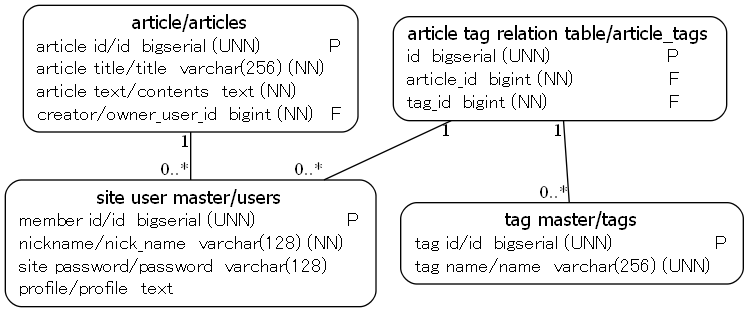

# erdm (ERD Musou)

Text base ERD tool


ERDM
====

Overview

unok/erdm - Text base ERD tool.

## Description

It is a tool to create documents such as ERD style image, HTML, DDL from text.

## Requirement

[Graphviz](http://www.graphviz.org/)

## Usage

```shell
% erdm -output_dir out table_difinitions.erdm
```

## Syntax

### sample 1

#### input

```text
# Title: ER Sample

users/"site user master"
    +id/"member id" [bigserial][NN][U]
    nick_name/nickname [varchar(128)][NN]
    password/"site password" [varchar(128)]
    profile/profile [text]

articles/article
    +id/"article id" [bigserial][NN][U]
    title/"article title" [varchar(256)][NN]
    contents/"article text" [text][NN]
    owner_user_id/creator [bigint][NN] 0..*--1 users

tags/"tag master"
    +id/"tag id" [bigserial][NN][U]
    name/"tag name" [varchar(256)][NN][U]

article_tags/"article tag relation table"
    +id [bigserial][NN][U]
    article_id [bigint][NN] 0..*--1 users
    tag_id [bigint][NN] 0..*--1 tags
```

#### output



## Licence

[MIT](https://github.com/tcnksm/tool/blob/master/LICENCE)

## Author

[unok](https://github.com/unok)
